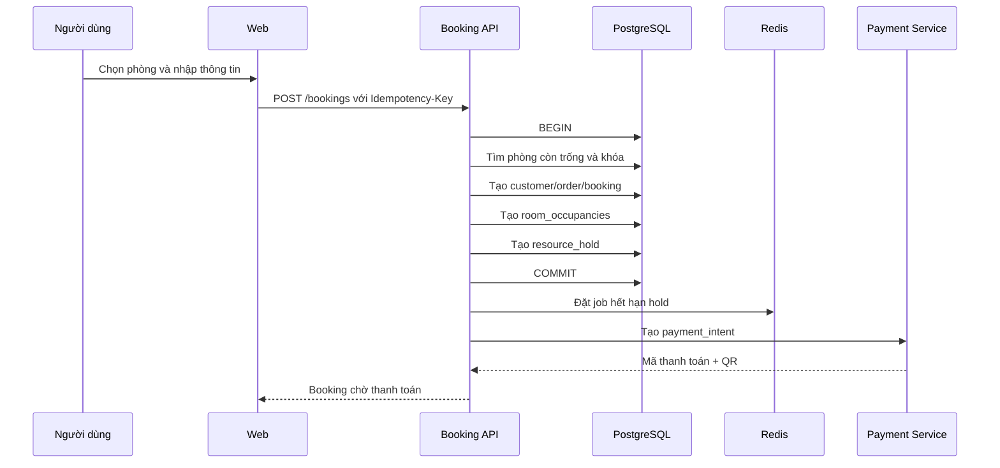

# TECHNICAL SPECIFICATION – PHASE 1
## WEBSITE MVP, BOOKING, BBQ, THANH TOÁN VÀ VẬN HÀNH
### VƯỜN MĂNG ĐEN – HOMESTAY & BBQ

**Mã tài liệu:** VMD-TECH-P01  
**Tên file:** `VMD_TECHSPEC_PHASE_01_MVP_BOOKING.md`  
**Phiên bản:** 1.1  
**Trạng thái:** Sẵn sàng dùng làm đầu vào triển khai  
**Phạm vi:** Phase 1  
**Tài liệu nguồn:**

- `VMD_PRD_PHASE_01_MVP_BOOKING.md`
- `VMD_00_MASTER_TECHNICAL_ARCHITECTURE.md`

**Mục tiêu tài liệu:** Chuyển PRD Phase 1 và Master Technical Architecture thành đặc tả kỹ thuật đủ chi tiết để đội phát triển hoặc Codex có thể tạo repository, database, API, giao diện, tích hợp SePay, email, Zalo, scheduler, dashboard quản trị, kiểm thử và triển khai môi trường thật.

---

# 1. Mục tiêu triển khai Phase 1

Phase 1 phải tạo ra một hệ thống vận hành thật, xử lý trọn vẹn chuỗi:

> Khách tìm hiểu → kiểm tra phòng hoặc bàn → tạo booking → giữ tài nguyên → thanh toán → xác nhận → nhắc lịch → check-in hoặc phục vụ → check-out hoặc hoàn thành → đối soát.

Kết quả cuối Phase 1 phải bao gồm:

1. Website công khai.
2. Hệ thống quản trị.
3. Booking phòng.
4. Booking BBQ.
5. Giỏ dịch vụ cơ bản.
6. Thanh toán SePay.
7. Email giao dịch.
8. Tích hợp Zalo theo cơ chế adapter.
9. Nhắc lịch T-7, T-3, T-1.
10. CMS và Blog.
11. Báo cáo cơ bản.
12. Phân quyền.
13. Audit log.
14. Hệ thống triển khai, sao lưu và giám sát.

---

# 2. Phạm vi kỹ thuật

## 2.1 Trong phạm vi

### Website công khai

- Trang chủ.
- Trang giới thiệu.
- Danh sách phòng.
- Chi tiết phòng.
- Kiểm tra phòng trống.
- Đặt phòng.
- Trang BBQ.
- Danh sách combo BBQ.
- Đặt bàn BBQ.
- Giỏ dịch vụ.
- Checkout.
- Thanh toán QR.
- Xác nhận booking.
- Tra cứu booking.
- Blog.
- Chi tiết bài viết.
- Liên hệ.
- Các trang chính sách.

### Hệ thống quản trị

- Đăng nhập.
- Dashboard.
- Quản lý loại phòng.
- Quản lý phòng thực tế.
- Quản lý giá phòng.
- Khóa phòng.
- Lịch booking.
- Quản lý booking.
- Quản lý khu vực, bàn và khung giờ BBQ.
- Quản lý combo BBQ.
- Quản lý thanh toán.
- Đối soát ngoại lệ.
- Quản lý khách hàng cơ bản.
- Quản lý nội dung.
- Quản lý voucher cơ bản.
- Quản lý notification template.
- Quản lý người dùng và vai trò.
- Báo cáo.
- Audit log.

### Tích hợp

- SePay webhook.
- Email provider.
- Zalo OA/ZNS adapter.
- Bản đồ hoặc liên kết chỉ đường.
- Object storage.
- Error monitoring.

## 2.2 Ngoài phạm vi

- AI Trip Planner.
- AI Concierge.
- CRM nâng cao.
- Marketing automation nâng cao.
- Thành viên công khai.
- Loyalty.
- Marketplace.
- Tour.
- Đối tác.
- OTA synchronization.
- Dynamic pricing.
- Ứng dụng mobile native.
- Tự động hoàn tiền qua ngân hàng.

---

# 3. Quyết định kỹ thuật cốt lõi

## 3.1 Kiến trúc

- Modular Monolith.
- API-first.
- Event-driven cho tác vụ nền.
- PostgreSQL là nguồn dữ liệu chuẩn.
- Redis dùng cho queue, cache, lock và hold tạm.
- Frontend và backend tách ứng dụng nhưng nằm trong cùng monorepo.
- Không triển khai microservices ở Phase 1.

## 3.2 Công nghệ nền

| Thành phần | Lựa chọn |
|---|---|
| Runtime | Node.js 24 LTS |
| Package manager | pnpm, khóa phiên bản bằng Corepack |
| Monorepo | Turborepo |
| Public Web | Next.js 16.2.x Active LTS, App Router, TypeScript |
| Admin Web | Next.js 16.2.x Active LTS, App Router, TypeScript |
| Backend API | NestJS 11, TypeScript |
| ORM | Prisma ORM 7 |
| Database | PostgreSQL 16 hoặc phiên bản managed tương thích |
| Managed platform đề xuất | Supabase Postgres, Auth và Storage |
| Cache/Queue | Redis + BullMQ |
| Validation | Zod ở frontend, class-validator hoặc Zod ở backend |
| API documentation | OpenAPI/Swagger |
| Styling | Tailwind CSS + design tokens |
| Form | React Hook Form |
| Query client | TanStack Query |
| Date/time | Luxon hoặc date-fns-tz |
| Testing | Vitest/Jest, Supertest, Playwright |
| Monitoring | Sentry + structured logs |
| CI/CD | GitHub Actions |
| Public hosting | Vercel |
| API/Worker hosting | Container platform hỗ trợ long-running service |
| Object storage | Supabase Storage hoặc S3-compatible |

## 3.3 Quy tắc phiên bản

- Commit lockfile.
- Không dùng wildcard `*`.
- Không tự động nâng major version.
- Production dùng patch bảo mật mới nhất trong cùng dòng Active LTS.
- Nâng dependency qua Pull Request riêng.
- Có regression test trước khi nâng phiên bản framework.

---

# 4. Kiến trúc triển khai

```text
                        ┌───────────────────────┐
                        │    Người dùng web     │
                        └───────────┬───────────┘
                                    │ HTTPS
                   ┌────────────────┴────────────────┐
                   │                                 │
          ┌────────▼────────┐               ┌────────▼────────┐
          │  Public Web App │               │   Admin Web App │
          │     Next.js     │               │     Next.js     │
          └────────┬────────┘               └────────┬────────┘
                   │                                 │
                   └────────────────┬────────────────┘
                                    │ REST /api/v1
                           ┌────────▼────────┐
                           │   NestJS API    │
                           │ Modular Monolith│
                           └───┬─────┬────┬──┘
                               │     │    │
                     ┌─────────▼┐ ┌──▼──┐ ┌▼────────────┐
                     │PostgreSQL│ │Redis│ │Object Storage│
                     └──────────┘ └──┬──┘ └─────────────┘
                                     │
                              ┌──────▼──────┐
                              │ BullMQ Worker│
                              └──────┬──────┘
                                     │
        ┌────────────────────────────┼─────────────────────────┐
        │                            │                         │
 ┌──────▼──────┐              ┌──────▼──────┐          ┌──────▼──────┐
 │    SePay    │              │ Email Provider│          │ Zalo OA/ZNS │
 └─────────────┘              └───────────────┘          └─────────────┘
```

---

# 5. Cấu trúc monorepo

```text
vmd-platform/
├── apps/
│   ├── web/                  # Website công khai
│   ├── admin/                # Dashboard nội bộ
│   ├── api/                  # NestJS API
│   └── worker/               # BullMQ workers
│
├── packages/
│   ├── ui/                   # Design system dùng chung
│   ├── config/               # ESLint, TypeScript, Tailwind
│   ├── types/                # Shared types không chứa nghiệp vụ server
│   ├── validation/           # Shared schemas
│   ├── api-client/           # Client sinh từ OpenAPI
│   ├── logging/              # Logger và correlation ID
│   ├── auth/                 # Auth utilities
│   └── testing/              # Test factories và fixtures
│
├── prisma/
│   ├── schema.prisma
│   ├── migrations/
│   └── seed/
│
├── infrastructure/
│   ├── docker/
│   ├── scripts/
│   └── monitoring/
│
├── docs/
│   ├── prd/
│   ├── architecture/
│   ├── techspec/
│   ├── adr/
│   └── api/
│
├── .github/
│   └── workflows/
├── turbo.json
├── pnpm-workspace.yaml
├── package.json
└── README.md
```

---

# 6. Cấu trúc module backend

```text
apps/api/src/
├── main.ts
├── app.module.ts
├── common/
│   ├── auth/
│   ├── guards/
│   ├── interceptors/
│   ├── filters/
│   ├── decorators/
│   ├── pagination/
│   ├── idempotency/
│   ├── audit/
│   └── events/
│
├── modules/
│   ├── identity/
│   ├── roles/
│   ├── customers/
│   ├── room-types/
│   ├── rooms/
│   ├── room-rates/
│   ├── availability/
│   ├── bookings/
│   ├── bbq/
│   ├── add-ons/
│   ├── carts/
│   ├── orders/
│   ├── payments/
│   ├── refunds/
│   ├── vouchers/
│   ├── notifications/
│   ├── scheduler/
│   ├── content/
│   ├── media/
│   ├── contacts/
│   ├── reporting/
│   ├── settings/
│   └── health/
│
└── infrastructure/
    ├── prisma/
    ├── redis/
    ├── queues/
    ├── storage/
    ├── email/
    ├── zalo/
    ├── sepay/
    └── observability/
```

Mỗi module áp dụng cấu trúc:

```text
module/
├── module.ts
├── controllers/
├── application/
│   ├── commands/
│   ├── queries/
│   └── services/
├── domain/
│   ├── entities/
│   ├── enums/
│   ├── events/
│   └── policies/
├── infrastructure/
│   ├── repositories/
│   └── adapters/
└── dto/
```

---

# 7. Nguyên tắc dữ liệu

## 7.1 Quy ước chung

- ID dùng UUID.
- Timestamp lưu UTC.
- Hiển thị theo `Asia/Ho_Chi_Minh`.
- Tiền lưu dạng số nguyên VND.
- Không dùng `float` cho tiền.
- Mọi bảng nghiệp vụ có `created_at`, `updated_at`.
- Bảng cần soft delete dùng `deleted_at`.
- Dữ liệu tài chính không soft delete; dùng trạng thái hoặc reversal.
- Enum quan trọng lưu bằng chuỗi có kiểm soát.
- Mọi bảng tài chính có `currency`, mặc định `VND`.

## 7.2 Tên cột

- `snake_case` ở database.
- `camelCase` trong TypeScript.
- Prisma map tên cột khi cần.

## 7.3 Múi giờ

- Backend nhận và trả ISO 8601.
- Trường ngày lưu trú dùng `DATE`.
- Trường thời điểm giao dịch dùng `TIMESTAMPTZ`.
- Scheduler tính theo `Asia/Ho_Chi_Minh`.
- Không dùng timezone của trình duyệt để xác định ngày check-in.

---

# 8. PostgreSQL extensions

Kích hoạt khi hạ tầng hỗ trợ:

```sql
CREATE EXTENSION IF NOT EXISTS pgcrypto;
CREATE EXTENSION IF NOT EXISTS btree_gist;
CREATE EXTENSION IF NOT EXISTS citext;
```

Phase 1 chưa bắt buộc:

- PostGIS.
- pgvector.

Nhưng database phải cho phép bổ sung ở Phase 2 và Phase 3.

---

# 9. Mô hình dữ liệu tổng quan

```text
auth.users
   │
   ├── staff_profiles ── staff_role_assignments ── roles ── role_permissions
   │
customers
   │
   ├── bookings ── booking_rooms ── rooms ── room_types
   │               ├── booking_guests
   │               ├── booking_add_ons
   │               └── booking_status_history
   │
   ├── bbq_reservations ── bbq_reservation_tables ── bbq_tables ── bbq_areas
   │                     ├── bbq_reservation_items
   │                     └── bbq_status_history
   │
   ├── orders ── order_items
   │      └── payment_intents ── payment_transactions
   │                             └── payment_webhook_events
   │
   ├── notification_jobs ── notification_deliveries
   │
   └── contact_submissions

content_pages
articles ── article_categories
media_assets

audit_logs
idempotency_keys
outbox_events
app_settings
```

---

# 10. Database schema chi tiết

## 10.1 `staff_profiles`

Hồ sơ nhân sự quản trị.

| Cột | Kiểu | Ràng buộc |
|---|---|---|
| id | uuid | PK |
| auth_user_id | uuid | UNIQUE, liên kết Auth |
| full_name | varchar(150) | NOT NULL |
| phone | varchar(20) | nullable |
| email | citext | NOT NULL |
| status | varchar(30) | ACTIVE, SUSPENDED, INVITED |
| last_login_at | timestamptz | nullable |
| created_at | timestamptz | NOT NULL |
| updated_at | timestamptz | NOT NULL |

## 10.2 `roles`

| Cột | Kiểu |
|---|---|
| id | uuid |
| code | varchar(50), UNIQUE |
| name | varchar(100) |
| description | text |
| is_system | boolean |
| created_at | timestamptz |

Vai trò seed:

- `SUPER_ADMIN`
- `ADMIN`
- `MANAGER`
- `RECEPTION`
- `MARKETING`
- `ACCOUNTANT`

## 10.3 `permissions`

Permission code dạng:

```text
booking.read
booking.create
booking.update
booking.cancel
booking.checkin
booking.checkout
payment.read
payment.reconcile
payment.refund_request
room.manage
bbq.manage
content.manage
report.read
user.manage
audit.read
```

## 10.4 `role_permissions`

- `role_id`
- `permission_id`

Unique composite:

```text
(role_id, permission_id)
```

## 10.5 `staff_role_assignments`

- `staff_id`
- `role_id`
- `assigned_by`
- `assigned_at`

---

## 10.6 `customers`

Khách hàng tách khỏi booking để chuẩn bị CRM Phase 2.

| Cột | Kiểu | Ghi chú |
|---|---|---|
| id | uuid | PK |
| customer_code | varchar(30) | UNIQUE |
| full_name | varchar(150) | NOT NULL |
| phone_normalized | varchar(20) | nullable, index |
| email_normalized | citext | nullable, index |
| source | varchar(50) | DIRECT, GOOGLE, FACEBOOK... |
| marketing_consent | boolean | default false |
| privacy_consent_at | timestamptz | nullable |
| notes | text | nullable |
| first_booking_at | timestamptz | nullable |
| last_booking_at | timestamptz | nullable |
| created_at | timestamptz | NOT NULL |
| updated_at | timestamptz | NOT NULL |
| deleted_at | timestamptz | nullable |

Không đặt UNIQUE tuyệt đối trên số điện thoại hoặc email vì một số gia đình có thể dùng chung thông tin. Logic phát hiện trùng thực hiện ở service.

---

## 10.7 `room_types`

| Cột | Kiểu |
|---|---|
| id | uuid |
| code | varchar(50), UNIQUE |
| name | varchar(150) |
| slug | varchar(180), UNIQUE |
| short_description | text |
| description | text |
| standard_adults | integer |
| max_adults | integer |
| max_children | integer |
| max_total_guests | integer |
| bed_configuration | jsonb |
| area_sqm | numeric(8,2) |
| base_price | bigint |
| extra_adult_price | bigint |
| extra_child_price | bigint |
| deposit_type | varchar(30) |
| deposit_value | bigint |
| check_in_time | time |
| check_out_time | time |
| amenities | jsonb |
| policies | jsonb |
| cover_media_id | uuid |
| status | varchar(30) |
| sort_order | integer |
| created_at | timestamptz |
| updated_at | timestamptz |
| deleted_at | timestamptz |

`deposit_type`:

- `FIXED`
- `PERCENT`
- `FULL_PAYMENT`

## 10.8 `rooms`

Phòng thực tế.

| Cột | Kiểu |
|---|---|
| id | uuid |
| room_type_id | uuid |
| code | varchar(50), UNIQUE |
| name | varchar(100) |
| floor | varchar(50) |
| area_zone | varchar(100) |
| status | varchar(30) |
| maintenance_notes | text |
| created_at | timestamptz |
| updated_at | timestamptz |
| deleted_at | timestamptz |

`status`:

- `ACTIVE`
- `MAINTENANCE`
- `INACTIVE`

## 10.9 `room_rate_rules`

Cho phép giá theo ngày và giai đoạn mà chưa cần dynamic pricing.

| Cột | Kiểu |
|---|---|
| id | uuid |
| room_type_id | uuid |
| name | varchar(150) |
| date_from | date |
| date_to | date |
| days_of_week | integer[] |
| nightly_price | bigint |
| extra_adult_price | bigint |
| extra_child_price | bigint |
| min_nights | integer |
| max_nights | integer |
| priority | integer |
| status | varchar(30) |
| created_at | timestamptz |
| updated_at | timestamptz |

Ưu tiên rule:

1. Rule có ngày cụ thể.
2. Rule theo mùa.
3. Rule theo ngày trong tuần.
4. Giá cơ bản của loại phòng.

## 10.10 `room_blocks`

Khóa phòng do sửa chữa hoặc sử dụng nội bộ.

| Cột | Kiểu |
|---|---|
| id | uuid |
| room_id | uuid |
| start_date | date |
| end_date | date |
| reason | text |
| block_type | varchar(30) |
| created_by | uuid |
| created_at | timestamptz |
| cancelled_at | timestamptz |

`end_date` là ngày mở lại, dùng khoảng `[start_date, end_date)`.

## 10.11 `resource_holds`

Hold tạm trước thanh toán.

| Cột | Kiểu |
|---|---|
| id | uuid |
| resource_type | varchar(30) |
| resource_id | uuid |
| reference_type | varchar(30) |
| reference_id | uuid |
| start_at | timestamptz |
| end_at | timestamptz |
| expires_at | timestamptz |
| status | varchar(30) |
| idempotency_key | varchar(150) |
| created_at | timestamptz |
| confirmed_at | timestamptz |
| released_at | timestamptz |

---

## 10.12 `bookings`

| Cột | Kiểu |
|---|---|
| id | uuid |
| booking_code | varchar(30), UNIQUE |
| customer_id | uuid |
| order_id | uuid |
| check_in_date | date |
| check_out_date | date |
| adults | integer |
| children | integer |
| infant_count | integer |
| expected_arrival_time | time |
| status | varchar(40) |
| source | varchar(50) |
| utm_source | varchar(100) |
| utm_medium | varchar(100) |
| utm_campaign | varchar(150) |
| subtotal_amount | bigint |
| discount_amount | bigint |
| surcharge_amount | bigint |
| tax_amount | bigint |
| total_amount | bigint |
| deposit_required_amount | bigint |
| paid_amount | bigint |
| remaining_amount | bigint |
| currency | char(3) |
| special_requests | text |
| cancellation_reason | text |
| cancelled_at | timestamptz |
| confirmed_at | timestamptz |
| checked_in_at | timestamptz |
| checked_out_at | timestamptz |
| created_at | timestamptz |
| updated_at | timestamptz |

## 10.13 `booking_rooms`

| Cột | Kiểu |
|---|---|
| id | uuid |
| booking_id | uuid |
| room_id | uuid |
| room_type_id | uuid |
| nightly_rate_snapshot | jsonb |
| amount | bigint |
| adults | integer |
| children | integer |
| created_at | timestamptz |

Snapshot phải lưu giá từng đêm:

```json
[
  {
    "date": "2026-10-10",
    "base_price": 850000,
    "extra_adult": 0,
    "extra_child": 0,
    "total": 850000,
    "rule_id": "uuid"
  }
]
```

## 10.14 `booking_guests`

| Cột | Kiểu |
|---|---|
| id | uuid |
| booking_id | uuid |
| full_name | varchar(150) |
| guest_type | varchar(30) |
| identity_number_encrypted | text |
| is_primary | boolean |
| created_at | timestamptz |

Phase 1 chỉ lưu thông tin giấy tờ khi thật sự cần cho vận hành.

## 10.15 `booking_status_history`

| Cột | Kiểu |
|---|---|
| id | uuid |
| booking_id | uuid |
| from_status | varchar(40) |
| to_status | varchar(40) |
| reason | text |
| actor_type | varchar(30) |
| actor_id | uuid |
| created_at | timestamptz |

---

## 10.16 `service_add_ons`

Dịch vụ mua thêm dùng chung.

| Cột | Kiểu |
|---|---|
| id | uuid |
| code | varchar(50), UNIQUE |
| name | varchar(150) |
| category | varchar(50) |
| description | text |
| pricing_type | varchar(30) |
| unit_price | bigint |
| max_quantity | integer |
| applicable_to | varchar(30) |
| requires_manual_confirmation | boolean |
| status | varchar(30) |
| created_at | timestamptz |
| updated_at | timestamptz |

Ví dụ:

- Ăn sáng.
- Giường phụ.
- Trang trí.
- Check-in sớm.
- Check-out muộn.
- Dịch vụ đưa đón.

## 10.17 `booking_add_ons`

| Cột | Kiểu |
|---|---|
| id | uuid |
| booking_id | uuid |
| add_on_id | uuid |
| quantity | integer |
| unit_price_snapshot | bigint |
| total_amount | bigint |
| scheduled_at | timestamptz |
| status | varchar(30) |
| notes | text |

---

## 10.18 `bbq_areas`

| Cột | Kiểu |
|---|---|
| id | uuid |
| code | varchar(50), UNIQUE |
| name | varchar(150) |
| description | text |
| min_capacity | integer |
| max_capacity | integer |
| cover_media_id | uuid |
| status | varchar(30) |
| sort_order | integer |

## 10.19 `bbq_tables`

| Cột | Kiểu |
|---|---|
| id | uuid |
| area_id | uuid |
| code | varchar(50), UNIQUE |
| name | varchar(100) |
| min_capacity | integer |
| max_capacity | integer |
| status | varchar(30) |
| turnaround_minutes | integer |
| created_at | timestamptz |
| updated_at | timestamptz |

## 10.20 `bbq_service_slots`

Định nghĩa khung giờ có thể đặt.

| Cột | Kiểu |
|---|---|
| id | uuid |
| area_id | uuid |
| name | varchar(100) |
| start_time | time |
| end_time | time |
| booking_interval_minutes | integer |
| max_total_guests | integer |
| days_of_week | integer[] |
| date_from | date |
| date_to | date |
| status | varchar(30) |

## 10.21 `bbq_combos`

| Cột | Kiểu |
|---|---|
| id | uuid |
| code | varchar(50), UNIQUE |
| name | varchar(150) |
| slug | varchar(180), UNIQUE |
| description | text |
| price | bigint |
| recommended_guests | integer |
| min_quantity | integer |
| items | jsonb |
| cover_media_id | uuid |
| status | varchar(30) |
| sort_order | integer |

## 10.22 `bbq_reservations`

| Cột | Kiểu |
|---|---|
| id | uuid |
| reservation_code | varchar(30), UNIQUE |
| customer_id | uuid |
| order_id | uuid |
| linked_booking_id | uuid |
| service_date | date |
| start_time | time |
| end_time | time |
| adults | integer |
| children | integer |
| total_guests | integer |
| area_preference_id | uuid |
| status | varchar(40) |
| occasion | varchar(100) |
| special_requests | text |
| subtotal_amount | bigint |
| discount_amount | bigint |
| total_amount | bigint |
| deposit_required_amount | bigint |
| paid_amount | bigint |
| remaining_amount | bigint |
| confirmed_at | timestamptz |
| arrived_at | timestamptz |
| completed_at | timestamptz |
| cancelled_at | timestamptz |
| created_at | timestamptz |
| updated_at | timestamptz |

## 10.23 `bbq_reservation_tables`

| Cột | Kiểu |
|---|---|
| id | uuid |
| reservation_id | uuid |
| table_id | uuid |
| created_at | timestamptz |

## 10.24 `bbq_reservation_items`

| Cột | Kiểu |
|---|---|
| id | uuid |
| reservation_id | uuid |
| combo_id | uuid |
| quantity | integer |
| unit_price_snapshot | bigint |
| total_amount | bigint |
| notes | text |

---

## 10.25 `carts`

| Cột | Kiểu |
|---|---|
| id | uuid |
| anonymous_token | varchar(150), UNIQUE |
| customer_id | uuid |
| status | varchar(30) |
| expires_at | timestamptz |
| created_at | timestamptz |
| updated_at | timestamptz |

## 10.26 `cart_items`

| Cột | Kiểu |
|---|---|
| id | uuid |
| cart_id | uuid |
| item_type | varchar(30) |
| reference_id | uuid |
| payload | jsonb |
| quantity | integer |
| price_snapshot | jsonb |
| created_at | timestamptz |
| updated_at | timestamptz |

Phase 1 hỗ trợ item type:

- `ROOM_BOOKING_DRAFT`
- `BBQ_RESERVATION_DRAFT`
- `ADD_ON`

## 10.27 `orders`

Đơn tổng dùng chung cho phòng và BBQ.

| Cột | Kiểu |
|---|---|
| id | uuid |
| order_code | varchar(30), UNIQUE |
| customer_id | uuid |
| status | varchar(40) |
| subtotal_amount | bigint |
| discount_amount | bigint |
| surcharge_amount | bigint |
| tax_amount | bigint |
| total_amount | bigint |
| payable_now_amount | bigint |
| paid_amount | bigint |
| currency | char(3) |
| voucher_id | uuid |
| source | varchar(50) |
| created_at | timestamptz |
| updated_at | timestamptz |
| expires_at | timestamptz |

## 10.28 `order_items`

| Cột | Kiểu |
|---|---|
| id | uuid |
| order_id | uuid |
| item_type | varchar(40) |
| reference_id | uuid |
| name_snapshot | varchar(200) |
| quantity | integer |
| unit_price | bigint |
| total_amount | bigint |
| metadata | jsonb |
| created_at | timestamptz |

---

## 10.29 `payment_intents`

| Cột | Kiểu |
|---|---|
| id | uuid |
| payment_code | varchar(40), UNIQUE |
| order_id | uuid |
| provider | varchar(30) |
| method | varchar(30) |
| amount | bigint |
| currency | char(3) |
| status | varchar(30) |
| bank_account_code | varchar(100) |
| transfer_content | varchar(100), UNIQUE |
| qr_payload | text |
| expires_at | timestamptz |
| idempotency_key | varchar(150) |
| created_at | timestamptz |
| updated_at | timestamptz |
| confirmed_at | timestamptz |

## 10.30 `payment_transactions`

| Cột | Kiểu |
|---|---|
| id | uuid |
| payment_intent_id | uuid |
| provider | varchar(30) |
| provider_transaction_id | varchar(150) |
| amount | bigint |
| transaction_time | timestamptz |
| transfer_content_raw | text |
| bank_account | varchar(100) |
| status | varchar(30) |
| match_status | varchar(30) |
| raw_data | jsonb |
| created_at | timestamptz |

Unique:

```text
(provider, provider_transaction_id)
```

## 10.31 `payment_webhook_events`

| Cột | Kiểu |
|---|---|
| id | uuid |
| provider | varchar(30) |
| provider_event_id | varchar(150) |
| signature_valid | boolean |
| payload | jsonb |
| headers | jsonb |
| processing_status | varchar(30) |
| attempt_count | integer |
| error_message | text |
| received_at | timestamptz |
| processed_at | timestamptz |

## 10.32 `payment_reconciliation_cases`

Dùng cho ngoại lệ.

| Cột | Kiểu |
|---|---|
| id | uuid |
| transaction_id | uuid |
| payment_intent_id | uuid |
| case_type | varchar(40) |
| status | varchar(30) |
| detected_amount | bigint |
| expected_amount | bigint |
| assigned_to | uuid |
| resolution | text |
| resolved_by | uuid |
| created_at | timestamptz |
| resolved_at | timestamptz |

Case type:

- `UNDERPAID`
- `OVERPAID`
- `NO_CODE`
- `MULTIPLE_MATCH`
- `LATE_PAYMENT`
- `DUPLICATE_EVENT`
- `UNKNOWN_TRANSACTION`

## 10.33 `refund_requests`

Phase 1 chỉ quản lý yêu cầu và ghi nhận hoàn tiền thủ công.

| Cột | Kiểu |
|---|---|
| id | uuid |
| order_id | uuid |
| payment_transaction_id | uuid |
| requested_amount | bigint |
| approved_amount | bigint |
| reason | text |
| status | varchar(30) |
| requested_by | uuid |
| approved_by | uuid |
| provider_reference | varchar(150) |
| proof_media_id | uuid |
| created_at | timestamptz |
| approved_at | timestamptz |
| completed_at | timestamptz |

---

## 10.34 `vouchers`

| Cột | Kiểu |
|---|---|
| id | uuid |
| code | varchar(50), UNIQUE |
| name | varchar(150) |
| discount_type | varchar(30) |
| discount_value | bigint |
| max_discount_amount | bigint |
| minimum_order_amount | bigint |
| applicable_to | varchar(30) |
| usage_limit_total | integer |
| usage_limit_per_customer | integer |
| start_at | timestamptz |
| end_at | timestamptz |
| status | varchar(30) |
| created_at | timestamptz |
| updated_at | timestamptz |

## 10.35 `voucher_redemptions`

- `voucher_id`
- `customer_id`
- `order_id`
- `discount_amount`
- `redeemed_at`

---

## 10.36 `notification_templates`

| Cột | Kiểu |
|---|---|
| id | uuid |
| code | varchar(80), UNIQUE |
| channel | varchar(30) |
| name | varchar(150) |
| subject_template | text |
| body_template | text |
| provider_template_id | varchar(150) |
| version | integer |
| status | varchar(30) |
| variables_schema | jsonb |
| created_at | timestamptz |
| updated_at | timestamptz |

Template code tối thiểu:

- `BOOKING_CONFIRMED_EMAIL`
- `BOOKING_CONFIRMED_ZALO`
- `BOOKING_REMINDER_T7_EMAIL`
- `BOOKING_REMINDER_T7_ZALO`
- `BOOKING_REMINDER_T3_EMAIL`
- `BOOKING_REMINDER_T3_ZALO`
- `BOOKING_REMINDER_T1_EMAIL`
- `BOOKING_REMINDER_T1_ZALO`
- `BBQ_CONFIRMED_EMAIL`
- `BBQ_CONFIRMED_ZALO`
- `PAYMENT_EXCEPTION_INTERNAL`

## 10.37 `notification_jobs`

| Cột | Kiểu |
|---|---|
| id | uuid |
| template_code | varchar(80) |
| recipient_type | varchar(30) |
| recipient_reference_id | uuid |
| email | citext |
| phone | varchar(20) |
| payload | jsonb |
| scheduled_at | timestamptz |
| status | varchar(30) |
| deduplication_key | varchar(180), UNIQUE |
| attempt_count | integer |
| last_error | text |
| created_at | timestamptz |
| completed_at | timestamptz |

## 10.38 `notification_deliveries`

| Cột | Kiểu |
|---|---|
| id | uuid |
| job_id | uuid |
| channel | varchar(30) |
| provider | varchar(50) |
| provider_message_id | varchar(150) |
| status | varchar(30) |
| response_data | jsonb |
| sent_at | timestamptz |
| delivered_at | timestamptz |
| failed_at | timestamptz |

---

## 10.39 `content_pages`

| Cột | Kiểu |
|---|---|
| id | uuid |
| page_key | varchar(80), UNIQUE |
| title | varchar(200) |
| slug | varchar(200), UNIQUE |
| content_blocks | jsonb |
| seo_title | varchar(200) |
| seo_description | varchar(300) |
| og_media_id | uuid |
| status | varchar(30) |
| version | integer |
| published_at | timestamptz |
| created_by | uuid |
| updated_by | uuid |
| created_at | timestamptz |
| updated_at | timestamptz |

## 10.40 `article_categories`

- `id`
- `name`
- `slug`
- `description`
- `sort_order`
- `status`

## 10.41 `articles`

| Cột | Kiểu |
|---|---|
| id | uuid |
| category_id | uuid |
| title | varchar(250) |
| slug | varchar(250), UNIQUE |
| excerpt | text |
| content | jsonb |
| cover_media_id | uuid |
| author_id | uuid |
| status | varchar(30) |
| seo_title | varchar(200) |
| seo_description | varchar(300) |
| canonical_url | text |
| published_at | timestamptz |
| created_at | timestamptz |
| updated_at | timestamptz |

## 10.42 `media_assets`

| Cột | Kiểu |
|---|---|
| id | uuid |
| bucket | varchar(100) |
| object_key | text |
| original_name | text |
| mime_type | varchar(100) |
| size_bytes | bigint |
| width | integer |
| height | integer |
| alt_text | text |
| visibility | varchar(30) |
| uploaded_by | uuid |
| created_at | timestamptz |
| deleted_at | timestamptz |

## 10.43 `contact_submissions`

| Cột | Kiểu |
|---|---|
| id | uuid |
| full_name | varchar(150) |
| phone | varchar(20) |
| email | citext |
| topic | varchar(80) |
| message | text |
| status | varchar(30) |
| assigned_to | uuid |
| source_page | text |
| created_at | timestamptz |
| resolved_at | timestamptz |

---

## 10.44 `audit_logs`

| Cột | Kiểu |
|---|---|
| id | uuid |
| actor_type | varchar(30) |
| actor_id | uuid |
| action | varchar(100) |
| resource_type | varchar(100) |
| resource_id | uuid |
| before_data | jsonb |
| after_data | jsonb |
| reason | text |
| ip_address | inet |
| user_agent | text |
| correlation_id | uuid |
| created_at | timestamptz |

## 10.45 `idempotency_keys`

| Cột | Kiểu |
|---|---|
| key | varchar(180), PK |
| scope | varchar(80) |
| request_hash | varchar(128) |
| response_status | integer |
| response_body | jsonb |
| expires_at | timestamptz |
| created_at | timestamptz |

## 10.46 `outbox_events`

| Cột | Kiểu |
|---|---|
| id | uuid |
| aggregate_type | varchar(80) |
| aggregate_id | uuid |
| event_type | varchar(100) |
| payload | jsonb |
| status | varchar(30) |
| attempt_count | integer |
| created_at | timestamptz |
| published_at | timestamptz |

## 10.47 `app_settings`

| Cột | Kiểu |
|---|---|
| key | varchar(150), PK |
| value | jsonb |
| category | varchar(80) |
| is_secret_reference | boolean |
| updated_by | uuid |
| updated_at | timestamptz |

Không lưu secret thật trong bảng này.

---

# 11. Database constraints quan trọng

## 11.1 Khoảng ngày hợp lệ

```sql
CHECK (check_out_date > check_in_date)
```

## 11.2 Số tiền không âm

```sql
CHECK (
  subtotal_amount >= 0
  AND discount_amount >= 0
  AND total_amount >= 0
  AND paid_amount >= 0
)
```

## 11.3 Số khách

```sql
CHECK (adults >= 1 AND children >= 0)
```

## 11.4 Chống transaction trùng

```sql
UNIQUE (provider, provider_transaction_id)
```

## 11.5 Chống notification trùng

```sql
UNIQUE (deduplication_key)
```

## 11.6 Chống cấp trùng phòng

Prisma không mô tả đầy đủ exclusion constraint; tạo migration SQL tùy chỉnh.

Có hai phương án:

### Phương án A – Bảng `room_occupancies`

Tạo occupancy cho từng ngày. Unique:

```text
(room_id, stay_date)
```

Đây là phương án đề xuất cho Phase 1 vì dễ hiểu và dễ kiểm tra.

Bảng:

```text
room_occupancies
- id
- room_id
- booking_id
- stay_date
- status
- created_at
UNIQUE(room_id, stay_date)
```

Khi booking chuyển sang trạng thái giữ hoặc xác nhận:

- Insert một dòng cho mỗi đêm.
- Nếu vi phạm unique, trả `BOOKING_CONFLICT`.

Khi hold hết hạn hoặc booking hủy:

- Xóa hoặc đổi trạng thái occupancy trong cùng transaction.

### Phương án B – PostgreSQL exclusion constraint

Dùng `daterange` và `EXCLUDE USING gist`.

Phương án này mạnh nhưng yêu cầu đội ngũ hiểu PostgreSQL sâu hơn.

**Quyết định Phase 1:** dùng bảng `room_occupancies`.

---

# 12. State machine booking phòng

## 12.1 Trạng thái

```text
DRAFT
PENDING_PAYMENT
PARTIALLY_PAID
PAID
CONFIRMED
MODIFIED
CANCELLED
REFUND_PENDING
REFUNDED
CHECKED_IN
CHECKED_OUT
NO_SHOW
EXPIRED
```

## 12.2 Chuyển trạng thái hợp lệ

```text
DRAFT → PENDING_PAYMENT
PENDING_PAYMENT → PARTIALLY_PAID
PENDING_PAYMENT → PAID
PENDING_PAYMENT → EXPIRED
PARTIALLY_PAID → CONFIRMED
PAID → CONFIRMED
CONFIRMED → MODIFIED
CONFIRMED → CANCELLED
MODIFIED → CONFIRMED
CONFIRMED → CHECKED_IN
CHECKED_IN → CHECKED_OUT
CONFIRMED → NO_SHOW
CANCELLED → REFUND_PENDING
REFUND_PENDING → REFUNDED
```

## 12.3 Quy tắc

- Không check-in khi booking chưa xác nhận.
- Không check-out nếu chưa check-in, trừ thao tác quản trị có lý do.
- Booking hủy phải giải phóng occupancy.
- Booking hết hạn phải giải phóng hold.
- Thay đổi ngày phải kiểm tra availability lại trong transaction.
- Mọi đổi trạng thái ghi `booking_status_history`.

---

# 13. State machine BBQ

```text
DRAFT
PENDING_PAYMENT
DEPOSIT_PAID
CONFIRMED
ARRIVED
COMPLETED
CANCELLED
NO_SHOW
REFUND_PENDING
REFUNDED
EXPIRED
```

Chuyển trạng thái:

```text
DRAFT → PENDING_PAYMENT
PENDING_PAYMENT → DEPOSIT_PAID
PENDING_PAYMENT → EXPIRED
DEPOSIT_PAID → CONFIRMED
CONFIRMED → ARRIVED
ARRIVED → COMPLETED
CONFIRMED → CANCELLED
CONFIRMED → NO_SHOW
CANCELLED → REFUND_PENDING
REFUND_PENDING → REFUNDED
```

---

# 14. State machine thanh toán

```text
CREATED
WAITING
MATCHED
PARTIALLY_PAID
PAID
EXPIRED
RECONCILIATION_REQUIRED
REFUND_PENDING
PARTIALLY_REFUNDED
REFUNDED
FAILED
```

Quy tắc:

- Webhook không trực tiếp xác nhận booking nếu chưa qua Payment Service.
- Payment Service phải kiểm tra order, amount, expiry và duplicate.
- Giao dịch thiếu/thừa tạo reconciliation case.
- Late payment không tự xác nhận booking nếu tài nguyên đã được bán cho khách khác.
- Mọi webhook raw phải được lưu trước khi xử lý.

---

# 15. Luồng kiểm tra phòng trống

## 15.1 API input

```json
{
  "checkInDate": "2026-10-10",
  "checkOutDate": "2026-10-12",
  "adults": 2,
  "children": 1
}
```

## 15.2 Logic

1. Kiểm tra ngày hợp lệ.
2. Tính số đêm.
3. Lọc loại phòng theo sức chứa.
4. Lấy phòng `ACTIVE`.
5. Loại phòng nằm trong `room_blocks`.
6. Loại phòng có occupancy trong khoảng ngày.
7. Tính giá từng đêm.
8. Trả loại phòng, số phòng còn và tổng giá dự kiến.

## 15.3 Response

```json
{
  "data": [
    {
      "roomTypeId": "uuid",
      "name": "Phòng Pine View",
      "availableCount": 2,
      "maxGuests": 4,
      "nightCount": 2,
      "price": {
        "roomAmount": 1700000,
        "extraGuestAmount": 200000,
        "totalAmount": 1900000
      },
      "rateBreakdown": [
        {
          "date": "2026-10-10",
          "amount": 850000
        },
        {
          "date": "2026-10-11",
          "amount": 850000
        }
      ]
    }
  ]
}
```

## 15.4 Không trả room ID công khai

Website chỉ chọn loại phòng. Backend cấp phòng cụ thể khi tạo hold.

---

# 16. Luồng tạo booking phòng



## 16.1 Transaction boundary

Trong một transaction phải tạo:

- Customer hoặc liên kết customer.
- Order.
- Booking.
- Booking room.
- Occupancy.
- Hold.
- Outbox event.

Payment intent có thể tạo ngay sau transaction. Nếu tạo payment intent thất bại:

- Booking vẫn ở `PENDING_PAYMENT`.
- Worker retry tạo payment intent.
- Frontend hiển thị trạng thái “Đang chuẩn bị thanh toán”.

## 16.2 Hold mặc định

- 30 phút — chốt lại theo dữ liệu chủ dự án 2026-09-01, xem `docs/09_MILESTONE_0_INPUT_PACK.md` §3A.
- Cấu hình bằng `BOOKING_HOLD_MINUTES`.
- Không cho vượt 360 phút (6 tiếng) trong MVP nếu không có quyền quản trị.

---

# 17. Luồng booking BBQ

## 17.1 Availability

Input:

- Ngày.
- Khung giờ.
- Số khách.
- Khu vực mong muốn.

Logic:

1. Lấy bàn active.
2. Loại bàn trùng reservation hoặc hold.
3. Tìm tổ hợp bàn đáp ứng số khách.
4. Kiểm tra giới hạn khách toàn khu vực.
5. Trả khu vực và phương án bàn, không công khai bắt buộc table ID.

## 17.2 Table allocation

Chiến lược:

1. Ưu tiên một bàn đủ sức chứa.
2. Nếu không có, ghép ít bàn nhất.
3. Hạn chế lãng phí sức chứa.
4. Quản lý có thể đổi bàn sau khi booking.

## 17.3 Hold

- Hold bàn 15 phút.
- Hết hạn phải giải phóng.
- Tạo `resource_holds` cho từng bàn.

---

# 18. Price Engine Phase 1

## 18.1 Input

- Room type.
- Date range.
- Adults.
- Children.
- Add-ons.
- Voucher.
- Tax configuration.

## 18.2 Công thức

```text
Room Subtotal
= Tổng giá từng đêm
+ Phụ thu người lớn
+ Phụ thu trẻ em

Order Subtotal
= Room Subtotal
+ Add-ons
+ BBQ Items

Discount
= Voucher discount có giới hạn

Total
= Subtotal - Discount + Surcharge + Tax

Payable Now
= Theo chính sách cọc
```

## 18.3 Snapshot

Tại thời điểm order:

- Lưu toàn bộ breakdown.
- Không tính lại lịch sử bằng rule mới.
- Nếu quản trị sửa booking, tạo phiên bản giá mới và audit.

## 18.4 Rounding

- VND làm tròn số nguyên.
- Không có số lẻ.
- Phần trăm dùng decimal chính xác.
- Mọi phép tính thực hiện backend.

---

# 19. Quy tắc tiền cọc

Cấu hình theo loại dịch vụ:

```json
{
  "room": {
    "type": "PERCENT",
    "value": 50
  },
  "bbq": {
    "type": "FIXED",
    "value": 500000
  }
}
```

Quy tắc:

- Cọc không vượt tổng tiền.
- Nếu tổng tiền thấp hơn cọc cố định, payable now bằng tổng tiền.
- Admin có thể ghi nhận thanh toán bổ sung.
- Không tự xác nhận booking khi thanh toán dưới mức cọc yêu cầu.

---

# 20. Tích hợp SePay

## 20.1 Phương thức triển khai

Phase 1 sử dụng:

- QR chuyển khoản.
- Nội dung chuyển khoản chứa mã thanh toán duy nhất.
- SePay webhook báo giao dịch.
- API tra cứu giao dịch dùng cho đối soát khi cần.

## 20.2 Mã chuyển khoản

Định dạng đề xuất:

```text
VMD{YYMM}{RANDOM}
```

Ví dụ:

```text
VMD2610A8K2P7
```

Yêu cầu:

- Viết hoa.
- Không dấu cách.
- Không dùng ký tự dễ nhầm.
- Unique.
- Không để lộ UUID.

## 20.3 Webhook endpoint

```text
POST /api/v1/webhooks/sepay/transactions
```

Endpoint này:

- Không dùng session auth.
- Bắt buộc xác thực webhook.
- Giới hạn IP khi khả thi.
- Lưu raw request.
- Trả response nhanh.
- Xử lý nghiệp vụ qua queue.

## 20.4 Authentication

Ưu tiên:

1. HMAC-SHA256.
2. OAuth 2.0 hoặc API Key theo cấu hình tài khoản.
3. Không dùng webhook không xác thực ở production.

## 20.5 Webhook handler

Pseudocode:

```ts
async function receiveSePayWebhook(request: Request) {
  const rawBody = request.rawBody;
  const headers = request.headers;

  const signatureValid = sepayAdapter.verify(rawBody, headers);

  const event = await webhookRepository.create({
    provider: 'SEPAY',
    providerEventId: extractEventId(rawBody),
    signatureValid,
    payload: parseJson(rawBody),
    headers: sanitizeHeaders(headers),
    processingStatus: signatureValid ? 'RECEIVED' : 'REJECTED',
  });

  if (!signatureValid) {
    throw new UnauthorizedException();
  }

  await paymentWebhookQueue.add(
    'process-sepay-transaction',
    { eventId: event.id },
    { jobId: `sepay:${event.providerEventId}` }
  );

  return { received: true };
}
```

## 20.6 Worker xử lý webhook

1. Load event.
2. Kiểm tra đã xử lý chưa.
3. Parse transaction.
4. Kiểm tra transaction duplicate.
5. Chuẩn hóa amount.
6. Tìm payment intent theo transfer content.
7. Kiểm tra expiry.
8. Kiểm tra amount.
9. Tạo transaction.
10. Cập nhật payment intent.
11. Cập nhật order.
12. Cập nhật booking hoặc BBQ.
13. Confirm resource hold.
14. Publish events.
15. Tạo notification jobs.
16. Mark webhook processed.

## 20.7 Xử lý thiếu tiền

- Payment intent → `PARTIALLY_PAID`.
- Booking → `PARTIALLY_PAID`.
- Không xác nhận booking.
- Tạo reconciliation case.
- Gửi thông báo nội bộ.
- Có thể gửi khách hướng dẫn thanh toán phần còn lại.

## 20.8 Xử lý thừa tiền

- Ghi nhận paid amount thực tế.
- Tạo reconciliation case.
- Booking có thể xác nhận nếu số tiền tối thiểu đã đủ.
- Không tự hoàn phần thừa.

## 20.9 Thanh toán muộn

Nếu hold đã hết hạn:

- Không tự chiếm lại phòng.
- Kiểm tra tài nguyên còn trống.
- Nếu còn trống, quản trị có thể xác nhận.
- Nếu không còn, tạo case xử lý thủ công.
- Gửi cảnh báo ngay.

## 20.10 Webhook lặp

- Unique provider transaction ID.
- Queue job có job ID cố định.
- Idempotency ở service.
- Lần gọi lặp trả thành công nhưng không xử lý lại.

## 20.11 Sandbox

- Tích hợp và kiểm thử SePay Test Mode trước production.
- Dùng webhook URL staging riêng.
- Không dùng tài khoản ngân hàng production trong automated test.

---

# 21. QR thanh toán

API:

```text
GET /api/v1/payment-intents/{id}/qr
```

Response:

```json
{
  "paymentIntentId": "uuid",
  "amount": 950000,
  "bankName": "Ngân hàng ...",
  "accountNumberMasked": "****1234",
  "accountName": "VUON MANG DEN",
  "transferContent": "VMD2610A8K2P7",
  "qrImageUrl": "signed-url",
  "expiresAt": "2026-08-05T13:15:00Z",
  "status": "WAITING"
}
```

Frontend polling:

- 3 giây trong 30 giây đầu.
- 5 giây sau đó.
- Dừng khi confirmed hoặc expired.
- Có nút “Tôi đã chuyển khoản”.
- Không xác nhận chỉ dựa vào thao tác nút.

---

# 22. Notification architecture

## 22.1 Channel adapter

```ts
interface NotificationProvider {
  send(message: NotificationMessage): Promise<NotificationResult>;
}
```

Adapter:

- `EmailProvider`
- `ZaloProvider`
- `SmsProvider` – chưa bật mặc định

## 22.2 Email

Email là kênh giao dịch bắt buộc khi khách cung cấp email.

Yêu cầu:

- Domain email chính thức.
- SPF.
- DKIM.
- DMARC.
- Template responsive.
- Plain-text fallback.
- Link có HTTPS.
- Không đưa dữ liệu nhạy cảm không cần thiết.

## 22.3 Zalo

Zalo được triển khai qua OA/ZNS khi:

- OA và ứng dụng đã được cấu hình.
- Template đã được phê duyệt.
- Biến template đúng schema.
- Số điện thoại đúng định dạng.

Nếu Zalo không khả dụng:

- Không làm booking thất bại.
- Ghi delivery failed.
- Gửi email.
- Hiển thị cảnh báo nội bộ.

## 22.4 Deduplication key

Ví dụ:

```text
booking:{bookingId}:confirmed:email
booking:{bookingId}:reminder:t7:zalo
booking:{bookingId}:reminder:t3:email
booking:{bookingId}:reminder:t1:zalo
```

## 22.5 Quiet hours

- Marketing: không gửi ngoài khung giờ cấu hình.
- Transactional: có thể gửi ngay.
- Reminder mặc định gửi 09:00 giờ Việt Nam.

---

# 23. Scheduler nhắc lịch

## 23.1 Cách tạo job

Khi booking được xác nhận:

- Tạo job T-7.
- Tạo job T-3.
- Tạo job T-1.

Nếu ngày check-in gần hơn:

- Bỏ các mốc đã qua.
- Chỉ tạo mốc còn hợp lệ.

## 23.2 Khi đổi ngày

Trong transaction:

1. Hủy job cũ bằng deduplication key/version.
2. Tạo job mới.
3. Ghi audit.

## 23.3 Khi hủy booking

- Job còn chờ chuyển `CANCELLED`.
- Worker phải kiểm tra trạng thái booking trước khi gửi.

## 23.4 Nội dung động

T-7:

- Thông tin booking.
- Số đêm.
- Địa chỉ.
- Bản đồ.
- Hotline.

T-3:

- Giờ check-in.
- Số tiền còn lại.
- Giờ dự kiến đến.
- Liên hệ đến muộn.

T-1:

- Áo lạnh.
- Thuốc chống côn trùng.
- Sạc dự phòng.
- Dây sạc.
- Giày.
- Ô hoặc áo mưa.
- Giấy tờ.
- Thuốc cá nhân.
- Thiết bị chụp ảnh.
- Lưu ý theo mùa do quản trị cấu hình.

---

# 24. Domain events Phase 1

```text
customer.created
order.created
booking.created
booking.hold_created
booking.hold_expired
booking.payment_received
booking.confirmed
booking.modified
booking.cancelled
booking.checked_in
booking.checked_out
bbq.reservation_created
bbq.confirmed
bbq.arrived
bbq.completed
payment.intent_created
payment.transaction_received
payment.matched
payment.reconciliation_required
notification.scheduled
notification.sent
notification.failed
content.published
contact.received
```

Event được ghi `outbox_events` trong cùng transaction với thay đổi nghiệp vụ.

Worker outbox:

- Poll event chưa publish.
- Đưa vào queue tương ứng.
- Đánh dấu published.
- Retry an toàn.

---

# 25. API conventions

## 25.1 Base path

```text
/api/v1
```

## 25.2 Response chuẩn

```json
{
  "data": {},
  "meta": {},
  "correlationId": "uuid"
}
```

## 25.3 Error chuẩn

```json
{
  "error": {
    "code": "BOOKING_CONFLICT",
    "message": "Phòng vừa được khách khác giữ. Vui lòng chọn lại.",
    "details": {
      "roomTypeId": "uuid"
    },
    "correlationId": "uuid"
  }
}
```

## 25.4 Pagination

```text
?cursor=...
&limit=20
```

## 25.5 Idempotency

Header:

```text
Idempotency-Key: <uuid-or-random-string>
```

Bắt buộc cho:

- `POST /bookings`
- `POST /bbq-reservations`
- `POST /orders`
- `POST /payment-intents`
- `POST /refund-requests`

---

# 26. Public API endpoints

## 26.1 Site content

```text
GET  /public/site-settings
GET  /public/pages/{slug}
GET  /public/articles
GET  /public/articles/{slug}
GET  /public/article-categories
```

## 26.2 Rooms

```text
GET  /public/room-types
GET  /public/room-types/{slug}
POST /public/availability/rooms/search
POST /public/bookings/quote
POST /public/bookings
GET  /public/bookings/{bookingCode}/lookup
```

## 26.3 BBQ

```text
GET  /public/bbq/areas
GET  /public/bbq/combos
POST /public/bbq/availability/search
POST /public/bbq/quote
POST /public/bbq-reservations
```

## 26.4 Cart and checkout

```text
POST   /public/carts
GET    /public/carts/{token}
POST   /public/carts/{token}/items
PATCH  /public/carts/{token}/items/{itemId}
DELETE /public/carts/{token}/items/{itemId}
POST   /public/carts/{token}/checkout
```

## 26.5 Payment

```text
GET  /public/payment-intents/{id}
GET  /public/payment-intents/{id}/qr
POST /public/payment-intents/{id}/acknowledge-transfer
```

## 26.6 Contact

```text
POST /public/contact-submissions
```

---

# 27. Admin API endpoints

## 27.1 Authentication

```text
POST /auth/login
POST /auth/logout
POST /auth/refresh
GET  /auth/me
```

Nếu dùng Supabase Auth:

- Frontend lấy access token.
- API xác minh JWT.
- Profile và role lấy từ database ứng dụng.

## 27.2 Rooms

```text
GET    /admin/room-types
POST   /admin/room-types
GET    /admin/room-types/{id}
PATCH  /admin/room-types/{id}
DELETE /admin/room-types/{id}

GET    /admin/rooms
POST   /admin/rooms
PATCH  /admin/rooms/{id}
POST   /admin/rooms/{id}/blocks
DELETE /admin/rooms/{id}/blocks/{blockId}

GET    /admin/room-rate-rules
POST   /admin/room-rate-rules
PATCH  /admin/room-rate-rules/{id}
DELETE /admin/room-rate-rules/{id}
```

## 27.3 Booking

```text
GET   /admin/bookings
GET   /admin/bookings/{id}
POST  /admin/bookings
PATCH /admin/bookings/{id}
POST  /admin/bookings/{id}/confirm
POST  /admin/bookings/{id}/cancel
POST  /admin/bookings/{id}/check-in
POST  /admin/bookings/{id}/check-out
POST  /admin/bookings/{id}/resend-confirmation
POST  /admin/bookings/{id}/reschedule
```

## 27.4 BBQ

```text
GET   /admin/bbq/areas
POST  /admin/bbq/areas
PATCH /admin/bbq/areas/{id}

GET   /admin/bbq/tables
POST  /admin/bbq/tables
PATCH /admin/bbq/tables/{id}

GET   /admin/bbq/slots
POST  /admin/bbq/slots
PATCH /admin/bbq/slots/{id}

GET   /admin/bbq/combos
POST  /admin/bbq/combos
PATCH /admin/bbq/combos/{id}

GET   /admin/bbq-reservations
GET   /admin/bbq-reservations/{id}
POST  /admin/bbq-reservations/{id}/confirm
POST  /admin/bbq-reservations/{id}/arrive
POST  /admin/bbq-reservations/{id}/complete
POST  /admin/bbq-reservations/{id}/cancel
```

## 27.5 Payments

```text
GET  /admin/payments
GET  /admin/payment-transactions
GET  /admin/reconciliation-cases
POST /admin/reconciliation-cases/{id}/resolve
POST /admin/payments/{id}/record-manual-payment
POST /admin/refund-requests
POST /admin/refund-requests/{id}/approve
POST /admin/refund-requests/{id}/complete
```

## 27.6 Content

```text
GET    /admin/pages
POST   /admin/pages
PATCH  /admin/pages/{id}
POST   /admin/pages/{id}/publish

GET    /admin/articles
POST   /admin/articles
PATCH  /admin/articles/{id}
POST   /admin/articles/{id}/publish

POST   /admin/media/upload-url
POST   /admin/media/complete
DELETE /admin/media/{id}
```

## 27.7 Reporting

```text
GET /admin/reports/dashboard
GET /admin/reports/bookings
GET /admin/reports/revenue
GET /admin/reports/occupancy
GET /admin/reports/bbq
GET /admin/reports/payments
GET /admin/reports/export
```

## 27.8 Users and audit

```text
GET    /admin/staff
POST   /admin/staff/invite
PATCH  /admin/staff/{id}
POST   /admin/staff/{id}/roles
DELETE /admin/staff/{id}/roles/{roleId}

GET /admin/audit-logs
```

---

# 28. Booking lookup security

Public lookup yêu cầu:

- Booking code.
- Phone hoặc email.

Endpoint không trả:

- Đầy đủ số điện thoại.
- Đầy đủ email.
- Dữ liệu giấy tờ.
- Audit.
- Ghi chú nội bộ.

Rate limit:

- 5 lần/phút/IP.
- 20 lần/ngày/IP cho lookup sai liên tục.
- Có CAPTCHA khi có dấu hiệu bất thường.

Response phải che dữ liệu:

```text
09******67
cu***@gmail.com
```

---

# 29. Frontend public routes

```text
/
 /gioi-thieu
 /luu-tru
 /luu-tru/{slug}
 /dat-phong
 /bbq
 /bbq/dat-ban
 /gio-hang
 /thanh-toan/{paymentIntentId}
 /dat-cho-thanh-cong/{orderCode}
 /tra-cuu
 /blog
 /blog/{slug}
 /lien-he
 /chinh-sach-dat-phong
 /chinh-sach-huy-hoan-tien
 /chinh-sach-bao-mat
 /dieu-khoan-su-dung
```

---

# 30. Frontend public component architecture

```text
app/
├── (marketing)/
│   ├── page.tsx
│   ├── gioi-thieu/
│   ├── luu-tru/
│   ├── bbq/
│   ├── blog/
│   └── lien-he/
│
├── (booking)/
│   ├── dat-phong/
│   ├── gio-hang/
│   ├── thanh-toan/[id]/
│   └── dat-cho-thanh-cong/[code]/
│
├── tra-cuu/
├── api/
└── sitemap.ts
```

Nguyên tắc:

- Server Components cho nội dung và SEO.
- Client Components cho form, calendar, cart và payment polling.
- Không gọi database trực tiếp.
- API client sinh từ OpenAPI.
- Form schema dùng chung với backend ở mức phù hợp.
- Route loading và error boundary riêng.

---

# 31. Admin routes

```text
/admin
/admin/dang-nhap
/admin/tong-quan
/admin/lich-phong
/admin/booking
/admin/booking/{id}
/admin/phong
/admin/loai-phong
/admin/gia-phong
/admin/khoa-phong
/admin/bbq/khu-vuc
/admin/bbq/ban
/admin/bbq/khung-gio
/admin/bbq/combo
/admin/bbq/dat-ban
/admin/thanh-toan
/admin/doi-soat
/admin/khach-hang
/admin/noi-dung/trang
/admin/noi-dung/bai-viet
/admin/noi-dung/media
/admin/voucher
/admin/thong-bao
/admin/bao-cao
/admin/nguoi-dung
/admin/audit
/admin/cau-hinh
```

---

# 32. Admin dashboard

## 32.1 Widgets

- Booking hôm nay.
- Check-in hôm nay.
- Check-out hôm nay.
- Đặt bàn hôm nay.
- Booking chờ thanh toán.
- Booking chưa xác nhận.
- Thanh toán cần đối soát.
- Doanh thu ngày.
- Tiền cọc đã thu.
- Công suất phòng 7 ngày.
- Notification lỗi.
- Contact chưa xử lý.

## 32.2 Calendar

Chế độ:

- Ngày.
- Tuần.
- Tháng.
- Theo phòng.

Màu:

- Chờ thanh toán.
- Xác nhận.
- Check-in.
- Check-out.
- Hủy.
- Khóa phòng.

---

# 33. RBAC matrix

| Chức năng | Super Admin | Manager | Reception | Marketing | Accountant |
|---|---:|---:|---:|---:|---:|
| Xem booking | ✓ | ✓ | ✓ | — | ✓ |
| Tạo booking | ✓ | ✓ | ✓ | — | — |
| Sửa booking | ✓ | ✓ | ✓ giới hạn | — | — |
| Hủy booking | ✓ | ✓ | Theo quyền | — | — |
| Check-in/out | ✓ | ✓ | ✓ | — | — |
| Quản lý phòng | ✓ | ✓ | Xem | — | — |
| Quản lý giá | ✓ | ✓ | — | — | Xem |
| Thanh toán | ✓ | ✓ | Xem | — | ✓ |
| Đối soát | ✓ | Xem | — | — | ✓ |
| Hoàn tiền | ✓ | Đề nghị | — | — | Xử lý theo quyền |
| Nội dung | ✓ | ✓ | — | ✓ | — |
| Voucher | ✓ | ✓ | — | ✓ | Xem |
| Báo cáo | ✓ | ✓ | Giới hạn | Tổng hợp | ✓ |
| Người dùng | ✓ | — | — | — | — |
| Audit | ✓ | ✓ giới hạn | — | — | ✓ tài chính |

Mọi quyền phải kiểm tra ở backend.

---

# 34. Authentication

## 34.1 Staff login

Đề xuất dùng Supabase Auth:

- Email/password.
- Magic link tùy chọn.
- MFA bật cho Super Admin và Accountant.
- Access token ngắn hạn.
- Refresh token rotation.

## 34.2 API validation

API:

1. Lấy Bearer token.
2. Xác minh chữ ký JWT.
3. Lấy `auth_user_id`.
4. Load staff profile.
5. Load role và permission.
6. Gắn actor context.
7. Audit thao tác nhạy cảm.

## 34.3 User public

Phase 1 không cần tài khoản khách.

Dùng:

- Anonymous cart token.
- Secure lookup link.
- Booking code + contact verification.

---

# 35. Security controls

## 35.1 HTTP

- HTTPS bắt buộc.
- HSTS.
- CSP.
- Secure headers.
- CORS chỉ cho domain được phép.
- CSRF protection nếu dùng cookie auth.
- Request body size limit.
- Upload size limit.

## 35.2 Rate limiting

| Endpoint | Giới hạn gợi ý |
|---|---|
| Availability | 30/phút/IP |
| Create booking | 5/phút/IP |
| Contact form | 3/10 phút/IP |
| Booking lookup | 5/phút/IP |
| Payment status | 60/phút/session |
| Login | 5/15 phút/account |
| Webhook | Theo provider/IP |

## 35.3 CAPTCHA

Bật cho:

- Contact form có dấu hiệu spam.
- Booking creation bất thường.
- Booking lookup sai nhiều lần.

## 35.4 Secret

Secret lưu trong secret manager:

- Database URL.
- Redis URL.
- Supabase service key.
- SePay key/secret.
- Email API key.
- Zalo app secret.
- Sentry DSN.
- Storage key.

## 35.5 PII

- Không log số điện thoại đầy đủ.
- Không log email đầy đủ.
- Mã hóa dữ liệu giấy tờ nếu lưu.
- Signed URL cho file riêng tư.
- Audit mọi export dữ liệu khách.

---

# 36. Media upload pipeline

## 36.1 Upload flow

```text
Admin yêu cầu signed upload URL
→ API kiểm tra quyền
→ Storage tạo URL tạm
→ Browser upload
→ Browser gọi complete endpoint
→ Worker kiểm tra metadata
→ Tạo thumbnail
→ Ghi media_assets
```

## 36.2 Giới hạn

- Ảnh: JPEG, PNG, WebP, AVIF.
- Video Phase 1: chỉ nhúng từ nguồn được duyệt hoặc giới hạn upload.
- Kích thước ảnh tối đa: cấu hình, ví dụ 15 MB.
- Strip EXIF khi không cần.
- Alt text bắt buộc cho ảnh nội dung chính.

---

# 37. CMS block model

`content_blocks` dùng cấu trúc có kiểm soát:

```json
[
  {
    "type": "hero",
    "version": 1,
    "data": {
      "title": "Vườn Măng Đen",
      "subtitle": "Homestay & BBQ giữa rừng thông",
      "mediaId": "uuid",
      "primaryCta": {
        "label": "Đặt phòng",
        "href": "/dat-phong"
      }
    }
  },
  {
    "type": "roomHighlights",
    "version": 1,
    "data": {
      "roomTypeIds": ["uuid"]
    }
  }
]
```

Block type Phase 1:

- Hero.
- Rich Text.
- Image Gallery.
- Video.
- Room Highlights.
- BBQ Highlights.
- Amenities.
- Testimonials.
- Blog Highlights.
- Contact.
- Map.
- CTA.
- FAQ.

Backend validate schema theo block type và version.

---

# 38. SEO technical requirements

- SSR cho trang phòng và bài viết.
- Metadata động.
- Canonical.
- Sitemap.
- Robots.
- Open Graph.
- Image alt.
- Breadcrumb.
- JSON-LD phù hợp.
- 301 redirect khi đổi slug.
- Không index checkout, admin, tra cứu booking.
- Trang kết quả availability có `noindex`.
- URL tiếng Việt không dấu.
- Ảnh responsive.
- Core Web Vitals được theo dõi.

---

# 39. Reporting queries

## 39.1 Công suất phòng

```text
Occupied Room Nights / Available Room Nights
```

Loại trừ:

- Phòng inactive.
- Phòng bị maintenance.
- Booking cancelled.
- Hold hết hạn.

## 39.2 Doanh thu

Phân biệt:

- Tổng giá trị booking.
- Tiền đã thu.
- Tiền còn phải thu.
- Doanh thu phòng.
- Doanh thu BBQ.
- Doanh thu add-on.
- Discount.

## 39.3 Nguồn khách

Theo:

- Direct.
- Google.
- Facebook.
- TikTok.
- Zalo.
- QR.
- Referral.
- UTM.

## 39.4 Export

- CSV bắt buộc.
- XLSX có thể bổ sung.
- Export chạy background khi dữ liệu lớn.
- File có thời hạn tải.
- Ghi audit.

---

# 40. Logging và correlation

Mỗi request tạo hoặc nhận:

```text
X-Correlation-ID
```

Log JSON:

```json
{
  "level": "info",
  "timestamp": "...",
  "service": "api",
  "correlationId": "uuid",
  "actorId": "uuid",
  "module": "payment",
  "event": "payment.matched",
  "resourceId": "uuid"
}
```

Không log:

- Secret.
- Raw password.
- Full ID number.
- Full bank account nếu không cần.
- Raw access token.

---

# 41. Observability

## 41.1 Metrics

- API request count.
- API p95 latency.
- Error rate.
- Database connection.
- Redis latency.
- Queue waiting/failed.
- Booking conflict count.
- Hold expired count.
- Payment webhook received.
- Payment match rate.
- Reconciliation count.
- Email success.
- Zalo success.
- Scheduler delay.

## 41.2 Alerts

P1:

- Database unavailable.
- Payment webhook processing stopped.
- Booking double-allocation risk.
- Queue stopped.

P2:

- Email failure trên ngưỡng.
- Zalo failure trên ngưỡng.
- Reconciliation tăng bất thường.
- API error rate cao.
- Disk/storage gần đầy.

## 41.3 Health endpoints

```text
GET /health/live
GET /health/ready
GET /health/dependencies
```

`dependencies` chỉ cho internal hoặc protected.

---

# 42. Queue definitions

```text
payment-webhook
notification-send
notification-schedule
booking-hold-expiry
bbq-hold-expiry
outbox-publish
media-process
report-export
maintenance
```

## 42.1 Retry defaults

- Payment webhook: 10 lần, exponential backoff.
- Email/Zalo: 5 lần.
- Media: 3 lần.
- Report: 3 lần.
- Hold expiry: retry đến khi thành công.

## 42.2 Dead-letter

Mỗi queue có dead-letter strategy.

Admin phải xem được:

- Job lỗi.
- Payload đã lọc dữ liệu nhạy cảm.
- Lý do.
- Retry thủ công.

---

# 43. Concurrency và transaction

## 43.1 Booking

Isolation:

- Transaction ở mức phù hợp.
- Lock candidate room.
- Insert occupancy.
- Unique constraint là lớp bảo vệ cuối.

## 43.2 Payment

- Transaction row lock khi cập nhật payment intent.
- Webhook event processed một lần.
- Update paid amount bằng dữ liệu transaction đã ghi.

## 43.3 Admin update

Sử dụng optimistic concurrency:

- `updated_at`.
- Hoặc `version` integer.

Nếu dữ liệu đã đổi:

```text
409 RESOURCE_VERSION_CONFLICT
```

---

# 44. Idempotency implementation

## 44.1 Request hash

Hash từ:

- Method.
- Path.
- Request body normalized.
- Actor/customer context.

## 44.2 Quy tắc

- Cùng key, cùng request → trả response cũ.
- Cùng key, khác request → `409 IDEMPOTENCY_CONFLICT`.
- TTL:
  - Booking: 24 giờ.
  - Payment: 7 ngày.
  - Refund: 30 ngày.

---

# 45. Error codes cốt lõi

```text
VALIDATION_ERROR
AUTHENTICATION_REQUIRED
PERMISSION_DENIED
RESOURCE_NOT_FOUND
RESOURCE_VERSION_CONFLICT
ROOM_NOT_AVAILABLE
BBQ_SLOT_NOT_AVAILABLE
BOOKING_HOLD_EXPIRED
BOOKING_INVALID_STATUS
PAYMENT_INTENT_EXPIRED
PAYMENT_AMOUNT_MISMATCH
PAYMENT_RECONCILIATION_REQUIRED
VOUCHER_INVALID
VOUCHER_EXPIRED
VOUCHER_USAGE_LIMIT
NOTIFICATION_PROVIDER_ERROR
RATE_LIMITED
INTERNAL_ERROR
```

---

# 46. Environment variables

```bash
# Runtime
NODE_ENV=
APP_ENV=
APP_TIMEZONE=Asia/Ho_Chi_Minh
PUBLIC_WEB_URL=
ADMIN_WEB_URL=
API_BASE_URL=

# Database
DATABASE_URL=
DIRECT_DATABASE_URL=

# Auth
SUPABASE_URL=
SUPABASE_ANON_KEY=
SUPABASE_SERVICE_ROLE_KEY=
JWT_ISSUER=
JWT_AUDIENCE=

# Redis
REDIS_URL=

# Storage
STORAGE_PROVIDER=supabase
STORAGE_BUCKET_PUBLIC=
STORAGE_BUCKET_PRIVATE=

# SePay
SEPAY_ENV=sandbox
SEPAY_API_BASE_URL=
SEPAY_API_KEY=
SEPAY_WEBHOOK_AUTH_TYPE=hmac
SEPAY_WEBHOOK_SECRET=
SEPAY_BANK_ACCOUNT_ID=
SEPAY_ACCOUNT_NAME=
SEPAY_BANK_NAME=

# Email
EMAIL_PROVIDER=
EMAIL_API_KEY=
EMAIL_FROM_NAME=
EMAIL_FROM_ADDRESS=
EMAIL_REPLY_TO=

# Zalo
ZALO_ENABLED=false
ZALO_APP_ID=
ZALO_APP_SECRET=
ZALO_OA_ID=
ZALO_ACCESS_TOKEN=
ZALO_REFRESH_TOKEN=

# Sentry
SENTRY_DSN=
SENTRY_ENVIRONMENT=

# Security
ENCRYPTION_KEY=
SIGNED_LINK_SECRET=
CORS_ALLOWED_ORIGINS=
CAPTCHA_SECRET=

# Booking
BOOKING_HOLD_MINUTES=30
BBQ_HOLD_MINUTES=30
DEFAULT_CURRENCY=VND
REMINDER_SEND_HOUR=9
```

---

# 47. Local development

## 47.1 Docker Compose

Dịch vụ:

- PostgreSQL.
- Redis.
- Mailpit.
- MinIO hoặc local storage mock.
- API.
- Worker.

## 47.2 Seed

Seed tối thiểu:

- Roles.
- Permissions.
- Super Admin.
- Room types mẫu.
- Rooms mẫu.
- BBQ areas.
- BBQ tables.
- Service slots.
- Notification templates.
- Content pages.
- App settings.

## 47.3 Mock providers

- SePay mock webhook.
- Email local inbox.
- Zalo mock adapter.
- Storage local.

---

# 48. Migrations

## 48.1 Quy tắc

- Mọi thay đổi schema qua migration.
- Không sửa migration đã chạy production.
- Migration tùy chỉnh cho constraint PostgreSQL được commit.
- Migration production chạy trong bước riêng.
- Backup trước migration lớn.

## 48.2 Deploy order

```text
Backup
→ Run backward-compatible migration
→ Deploy API
→ Deploy Worker
→ Deploy Web/Admin
→ Run smoke test
→ Remove deprecated field ở lần deploy sau
```

---

# 49. CI/CD

## 49.1 Pull Request pipeline

```text
Install
→ Lint
→ Type Check
→ Unit Test
→ Prisma Validate
→ Migration Check
→ Build
→ Integration Test
→ Security Scan
→ Preview Deploy
```

## 49.2 Main branch

- Deploy staging tự động.
- E2E staging.
- Approval production.
- Migration production.
- Deploy API/worker.
- Deploy frontend.
- Smoke test.
- Notify team.

## 49.3 Rollback

- Frontend rollback qua deployment version.
- API rollback qua container image.
- Database ưu tiên forward fix.
- Không rollback migration mất dữ liệu nếu chưa có kế hoạch.

---

# 50. Deployment environments

## 50.1 Development

- Dữ liệu giả.
- Provider mock.
- Debug log.

## 50.2 Staging

- Database riêng.
- SePay Test Mode.
- Email staging.
- Zalo test hoặc mock.
- Domain riêng.
- Dữ liệu không dùng khách thật.

## 50.3 Production

- Database production.
- Secrets production.
- Backup.
- Monitoring.
- MFA.
- Rate limiting.
- Webhook production.

---

# 51. Backup và khôi phục

## 51.1 Database

- Daily backup.
- Point-in-time recovery nếu gói hạ tầng hỗ trợ.
- Kiểm tra restore định kỳ.
- Backup trước release lớn.

## 51.2 Storage

- Versioning.
- Lifecycle.
- Không xóa vật lý ngay file liên quan tài chính hoặc khiếu nại.
- Media public có thể tái tạo thumbnail.

## 51.3 Mục tiêu

- RPO: tối đa 15 phút khi hạ tầng hỗ trợ.
- RTO: tối đa 4 giờ ở Phase 1.

---

# 52. Testing strategy

## 52.1 Unit test bắt buộc

- Price engine.
- Deposit calculation.
- Voucher calculation.
- Room allocation.
- BBQ table allocation.
- Booking state machine.
- Payment matching.
- Notification deduplication.
- Permission checks.

## 52.2 Integration test

- Booking transaction.
- Occupancy unique.
- Hold expiry.
- Payment webhook.
- Partial payment.
- Overpayment.
- Late payment.
- Notification scheduling.
- Reschedule.
- Cancel and release room.

## 52.3 E2E public

1. Tìm phòng.
2. Chọn phòng.
3. Nhập thông tin.
4. Tạo booking.
5. Hiển thị QR.
6. Mô phỏng webhook.
7. Nhận xác nhận.
8. Tra cứu booking.

## 52.4 E2E admin

1. Login.
2. Xem lịch.
3. Tạo booking thủ công.
4. Check-in.
5. Check-out.
6. Xử lý payment exception.
7. Đăng bài.
8. Export báo cáo.

## 52.5 Security test

- Unauthorized access.
- Role escalation.
- IDOR.
- Rate limiting.
- Webhook invalid signature.
- Replay webhook.
- File upload invalid.
- Booking lookup brute force.
- XSS content.
- SQL injection.

## 52.6 Load test

Kịch bản tối thiểu:

- 100 người đồng thời tìm phòng.
- 20 người đồng thời tạo booking cùng loại phòng.
- 50 webhook trong một phút.
- 1.000 lượt xem homepage trong 5 phút.

Điều kiện quan trọng:

- Không double booking.
- Không double payment.
- Queue không mất job.

---

# 53. Acceptance criteria kỹ thuật

## 53.1 Booking

- Không thể cấp cùng một phòng cho hai booking cùng đêm.
- Hold tự hết hạn.
- Booking code unique.
- Giá snapshot đúng.
- Reschedule kiểm tra lại availability.
- Hủy giải phóng phòng.

## 53.2 BBQ

- Không thể cấp cùng bàn trong cùng khoảng thời gian.
- Sức chứa hợp lệ.
- Có thời gian dọn bàn.
- Hold tự hết hạn.

## 53.3 Payment

- Webhook xác thực.
- Webhook lặp không ghi nhận hai lần.
- Thanh toán đủ tự xác nhận đúng booking.
- Thiếu/thừa tiền tạo case.
- Late payment không gây double booking.
- Có raw webhook và audit.

## 53.4 Notification

- Email xác nhận gửi sau payment confirmation.
- Reminder T-7, T-3, T-1 đúng thời điểm.
- Booking hủy không nhận reminder.
- Đổi lịch tạo lại reminder.
- Zalo lỗi không làm booking lỗi.

## 53.5 Admin

- Role đúng quyền.
- Booking tra cứu dưới 30 giây thao tác.
- Calendar phản ánh đúng trạng thái.
- Payment exception có thể xử lý.
- Audit log có đủ actor và thay đổi.

## 53.6 Website

- Mobile-first.
- Trang chính đạt mục tiêu hiệu năng.
- SEO cơ bản hoạt động.
- Checkout không index.
- Form có validation và lỗi rõ ràng.

---

# 54. Definition of Done

Một hạng mục chỉ hoàn thành khi:

- Code review.
- Test đạt.
- API document cập nhật.
- Migration có kiểm tra.
- Log và error handling có đủ.
- Permission được kiểm tra.
- Audit có đủ nếu là thao tác nhạy cảm.
- UI có trạng thái loading, empty, error.
- Mobile kiểm thử.
- Staging nghiệm thu.
- Tài liệu vận hành cập nhật.

---

# 55. Kế hoạch sprint kỹ thuật

## Sprint 0 – Foundation

- Monorepo.
- Next.js web/admin.
- NestJS API.
- Worker.
- PostgreSQL.
- Redis.
- Prisma.
- Auth.
- Logging.
- CI/CD.
- Staging.

## Sprint 1 – CMS và website nền

- Homepage.
- Giới thiệu.
- Lưu trú.
- BBQ.
- Blog.
- Liên hệ.
- Media.
- SEO.
- Admin content.

## Sprint 2 – Room inventory và pricing

- Room type.
- Room.
- Rate rule.
- Room block.
- Availability.
- Price engine.
- Admin room calendar.

## Sprint 3 – Booking phòng

- Customer.
- Cart.
- Order.
- Booking.
- Hold.
- Occupancy.
- Booking lookup.
- Admin booking.

## Sprint 4 – BBQ booking

- Area.
- Table.
- Slot.
- Combo.
- Availability.
- Reservation.
- Admin BBQ.

## Sprint 5 – Payment SePay

- Payment intent.
- QR.
- Webhook.
- Matching.
- Exception.
- Payment admin.
- Sandbox test.

## Sprint 6 – Notification và scheduler

- Template.
- Email.
- Zalo adapter.
- Queue.
- T-7, T-3, T-1.
- Delivery dashboard.

## Sprint 7 – Reporting, security và operations

- Dashboard.
- Reports.
- Export.
- Audit.
- Rate limiting.
- Backup.
- Monitoring.
- Runbook.

## Sprint 8 – UAT và launch

- Data seed thật.
- Training.
- UAT.
- Load test.
- Security review.
- Soft launch.
- Production launch.
- Hypercare.

---

# 56. Dữ liệu đầu vào cần chốt trước khi code nghiệp vụ

## 56.1 Lưu trú

- Danh sách loại phòng.
- Danh sách phòng thực tế.
- Sức chứa.
- Cấu hình giường.
- Giá thường.
- Giá cuối tuần.
- Giá lễ.
- Phụ thu.
- Tiền cọc.
- Giờ check-in/out.
- Chính sách trẻ em.
- Chính sách hủy.

## 56.2 BBQ

- Khu vực.
- Danh sách bàn.
- Sức chứa.
- Khung giờ.
- Thời lượng bàn.
- Thời gian dọn.
- Mức cọc.
- Combo.
- Giá.
- Chính sách hủy.

## 56.3 Tích hợp

- Domain.
- Tài khoản SePay.
- Tài khoản ngân hàng.
- Email domain.
- Email provider.
- Zalo OA.
- ZNS template.
- Storage.
- Cloud hosting.

## 56.4 Vận hành

- Danh sách vai trò.
- Người xử lý booking.
- Người đối soát.
- Người xử lý refund.
- Hotline.
- SLA nội bộ.
- Quy trình check-in/out.

---

# 57. Runbook vận hành tối thiểu

Cần tạo các tài liệu đi kèm:

1. Hướng dẫn tạo và sửa booking.
2. Hướng dẫn khóa phòng.
3. Hướng dẫn cập nhật giá.
4. Hướng dẫn check-in/check-out.
5. Hướng dẫn xử lý khách chuyển thiếu tiền.
6. Hướng dẫn xử lý khách chuyển thừa tiền.
7. Hướng dẫn xử lý thanh toán không có mã.
8. Hướng dẫn hủy và hoàn tiền.
9. Hướng dẫn sửa template.
10. Hướng dẫn xử lý notification lỗi.
11. Hướng dẫn restore dữ liệu.
12. Hướng dẫn xử lý sự cố SePay.

---

# 58. Các ADR cần tạo trong Phase 1

- `ADR-001-MODULAR-MONOLITH.md`
- `ADR-002-NEXTJS-NESTJS.md`
- `ADR-003-POSTGRES-PRISMA.md`
- `ADR-004-SUPABASE-AUTH-STORAGE.md`
- `ADR-005-REDIS-BULLMQ.md`
- `ADR-006-ROOM-OCCUPANCY-MODEL.md`
- `ADR-007-SEPAY-WEBHOOK-IDEMPOTENCY.md`
- `ADR-008-NOTIFICATION-PROVIDER-ADAPTER.md`
- `ADR-009-OUTBOX-PATTERN.md`
- `ADR-010-PUBLIC-BOOKING-WITHOUT-ACCOUNT.md`

---

# 59. Rủi ro kỹ thuật và biện pháp

## 59.1 Double booking

**Biện pháp:**

- Occupancy unique constraint.
- Transaction.
- Lock.
- Concurrency test.

## 59.2 Webhook lặp hoặc đến sai thứ tự

**Biện pháp:**

- Raw event store.
- Provider event uniqueness.
- Idempotent worker.
- State validation.

## 59.3 Serverless không phù hợp worker

**Biện pháp:**

- API và worker chạy trên container long-running.
- Frontend có thể chạy Vercel.
- Không dùng frontend cron làm nguồn scheduler duy nhất.

## 59.4 Zalo chưa được duyệt

**Biện pháp:**

- Email là kênh bắt buộc.
- Zalo adapter có thể tắt.
- Không phụ thuộc Zalo để xác nhận booking.

## 59.5 Giá thay đổi trong lúc checkout

**Biện pháp:**

- Quote có thời hạn.
- Kiểm tra giá lại trước tạo order.
- Snapshot.
- Hiển thị thay đổi cho khách.

## 59.6 Dữ liệu setup thay đổi

**Biện pháp:**

- Admin quản lý nội dung và phòng.
- Không hard-code.
- Import template.
- Có status draft.

---

# 60. Kết quả bàn giao Phase 1

Đội phát triển phải bàn giao:

- Source code monorepo.
- Database schema và migration.
- Seed script.
- OpenAPI specification.
- Website public.
- Admin portal.
- API.
- Worker.
- SePay integration.
- Email integration.
- Zalo adapter.
- CI/CD.
- Staging.
- Production.
- Test report.
- Security checklist.
- Backup/restore guide.
- Operational runbook.
- Architecture Decision Records.
- Hướng dẫn cấu hình.
- Tài khoản và quyền bàn giao.
- Danh sách secret không ghi giá trị.
- Biên bản UAT.

---

# 61. Thứ tự triển khai sau tài liệu này

1. Chốt các dữ liệu đầu vào tại Mục 56.
2. Tạo ADR.
3. Khởi tạo monorepo.
4. Tạo Prisma schema và migration đầu tiên.
5. Tạo OpenAPI skeleton.
6. Xây module Identity và RBAC.
7. Xây CMS và website nền.
8. Xây Room Availability.
9. Xây Booking.
10. Xây BBQ.
11. Tích hợp SePay.
12. Tích hợp notification.
13. Xây Admin và báo cáo.
14. Kiểm thử.
15. UAT.
16. Ra mắt giới hạn.
17. Ra mắt chính thức.

---


# 62. Capacity Planning & Production Readiness

## 62.1 Giả định lưu lượng

Phase 1 được thiết kế cho mức lưu lượng ban đầu:

- Từ 2.000 đến 5.000 lượt truy cập mỗi ngày.
- Mức thiết kế bình thường: 15.000 đến 25.000 lượt truy cập mỗi ngày mà không phải thay đổi kiến trúc lõi.
- Mức load test quy đổi: 25.000 đến 50.000 lượt truy cập mỗi ngày.
- Giờ cao điểm có thể cao gấp 10–20 lần mức trung bình.
- Phần lớn lượt xem trang nội dung phải được CDN và cache xử lý, không đi trực tiếp vào API.
- Booking, thanh toán, availability và admin luôn được xử lý theo thời gian thực.

Mục tiêu của chương này không phải xây hạ tầng quá lớn, mà bảo đảm:

1. Không trùng booking khi nhiều khách thao tác đồng thời.
2. Không mất webhook thanh toán.
3. Không gửi trùng email, Zalo hoặc reminder.
4. Hệ thống vẫn vận hành khi một nhà cung cấp bên ngoài gặp lỗi.
5. Có thể tăng tài nguyên nhanh trước chiến dịch quảng cáo hoặc mùa cao điểm.

---

## 62.2 Sơ đồ hạ tầng sản xuất

```text
Người dùng
    │
    ▼
CDN + WAF
    │
    ├── Public Web – Next.js
    │     ├── Trang chủ
    │     ├── Phòng
    │     ├── BBQ
    │     └── Blog
    │
    └── Admin Web – Next.js
          │
          ▼
NestJS API Container
    ├── Booking
    ├── BBQ
    ├── Payment
    ├── CMS
    ├── Admin
    └── Reporting
          │
          ├── PostgreSQL Managed
          ├── Redis Managed
          ├── Object Storage + CDN
          └── BullMQ Worker
                 ├── Payment webhook
                 ├── Email
                 ├── Zalo
                 ├── Reminder
                 ├── Report export
                 └── Media processing
```

Nguyên tắc triển khai:

- Website công khai có thể chạy trên Vercel hoặc nền tảng tương đương.
- API và Worker phải chạy trên nền tảng hỗ trợ long-running process.
- API, Worker, PostgreSQL và Redis phải đặt cùng khu vực địa lý.
- Không dùng frontend function làm scheduler duy nhất.
- Không gửi email hoặc Zalo trực tiếp bên trong transaction booking.

---

## 62.3 Cấu hình hạ tầng khởi điểm

### 62.3.1 Public Web

| Hạng mục | Cấu hình ban đầu |
|---|---|
| Runtime | Next.js |
| CDN | Bắt buộc |
| Image optimization | Bắt buộc |
| Cache/ISR | Bắt buộc với nội dung công khai |
| Auto-scaling | Theo nền tảng hosting |
| Bandwidth dự phòng | Tối thiểu gấp 2–3 lần dự báo |
| Domain | HTTPS, DNS được quản trị tập trung |
| WAF/Bot protection | Nên bật |

### 62.3.2 Admin Web

| Hạng mục | Cấu hình ban đầu |
|---|---|
| Hosting | Vercel hoặc container |
| Domain | Tách domain/subdomain khỏi public web |
| Cache | Không cache dữ liệu nghiệp vụ |
| Auth | Bắt buộc |
| MFA | Bắt buộc cho Super Admin và Accountant |
| IP allowlist | Có thể bật cho thao tác tài chính nhạy cảm |

### 62.3.3 NestJS API

| Hạng mục | Cấu hình đề xuất |
|---|---|
| CPU | 1–2 vCPU |
| RAM | 2 GB |
| Replica ban đầu | 1 |
| Replica khi chạy chiến dịch | 2 |
| Max replica ban đầu | 3 |
| Health check | Bắt buộc |
| Auto restart | Bắt buộc |
| Request timeout | Cấu hình theo endpoint |
| Graceful shutdown | Bắt buộc |

Cấu hình này phù hợp nếu:

- Trang nội dung được cache.
- Ảnh không đi qua API.
- Truy vấn database có index.
- Báo cáo nặng chạy qua Worker.
- Kết nối database được pool đúng cách.

### 62.3.4 Worker

| Hạng mục | Cấu hình đề xuất |
|---|---|
| CPU | 1 vCPU |
| RAM | 1 GB |
| Replica ban đầu | 1 |
| Payment webhook concurrency | 5 |
| Email/Zalo concurrency | 5–10 |
| Report concurrency | 1–2 |
| Auto restart | Bắt buộc |
| Queue monitoring | Bắt buộc |

### 62.3.5 PostgreSQL

| Hạng mục | Cấu hình đề xuất |
|---|---|
| CPU | 2 vCPU |
| RAM | 2–4 GB |
| Storage | 20–30 GB SSD ban đầu |
| Backup | Hằng ngày |
| PITR | Nên bật |
| Region | Cùng API |
| Connection pooling | Bắt buộc |
| Slow query monitoring | Bắt buộc |

Không sử dụng database miễn phí cho production booking.

### 62.3.6 Redis

| Hạng mục | Cấu hình đề xuất |
|---|---|
| RAM | 256–512 MB |
| TLS | Bắt buộc |
| Persistence | Nên bật |
| Dùng cho | Queue, lock, cache, rate limit, hold |
| Queue loss protection | Bắt buộc |
| Memory alert | Bắt buộc |

Không sử dụng Redis làm nguồn dữ liệu duy nhất cho:

- Booking.
- Payment.
- Order.
- Trạng thái đối soát.
- Lịch sử giao dịch.

### 62.3.7 Object Storage

| Hạng mục | Cấu hình đề xuất |
|---|---|
| Dung lượng ban đầu | 20 GB |
| CDN | Bắt buộc cho ảnh public |
| Versioning | Nên bật |
| Private files | Signed URL |
| Image derivatives | Thumbnail, WebP/AVIF |
| File export | Tự hết hạn |

---

## 62.4 Connection Pooling

Cấu hình khởi điểm:

```text
API instance: 5–10 database connections
Worker: 3–5 database connections
Migration/Admin: direct connection riêng
Tổng kết nối ứng dụng mục tiêu: 15–25 connections
```

Quy tắc:

- Không cấu hình 50–100 connection cho mỗi instance.
- Migration không dùng pooled connection khi công cụ yêu cầu direct connection.
- Khi tăng replica API phải tính lại tổng số connection.
- Cảnh báo khi connection pool sử dụng trên 70%.
- Endpoint báo cáo phải tránh giữ connection lâu.

---

## 62.5 Cache Matrix

| Nội dung | Cache | Thời gian gợi ý |
|---|---:|---:|
| Trang chủ | Có | 5–15 phút |
| Trang giới thiệu | Có | 30–60 phút |
| Nội dung loại phòng | Có | 5–15 phút |
| Danh sách phòng | Có điều kiện | 5 phút |
| Giá tham khảo | Cache ngắn | 1–5 phút |
| Blog | Có | 30–60 phút |
| Ảnh | CDN dài hạn | 30 ngày–1 năm |
| Site settings | Có | 5–15 phút |
| Kiểm tra phòng trống | Không cache công khai | Thời gian thực |
| Tạo booking | Không | Không cache |
| Trạng thái booking | Không | Không cache |
| Thanh toán | Không | Không cache |
| Admin | Không | Không cache |
| Báo cáo tổng hợp | Có thể cache | 1–5 phút |

Quy tắc invalidation:

- Khi xuất bản bài viết: revalidate bài viết, danh sách blog và sitemap.
- Khi sửa phòng: revalidate trang phòng liên quan.
- Khi sửa giá: xóa cache quote liên quan.
- Khi sửa site settings: revalidate trang dùng cấu hình đó.
- Không xóa toàn bộ cache nếu chỉ một tài nguyên thay đổi.

---

## 62.6 Index và Constraint phục vụ tải

### 62.6.1 Index bắt buộc

```text
room_occupancies(room_id, stay_date)
room_occupancies(stay_date, status)
bookings(booking_code)
bookings(status, check_in_date)
bookings(customer_id, created_at)
bookings(created_at)
bbq_reservations(service_date, start_time, status)
payment_intents(transfer_content)
payment_intents(status, expires_at)
payment_transactions(provider, provider_transaction_id)
payment_transactions(transaction_time)
payment_webhook_events(processing_status, received_at)
notification_jobs(status, scheduled_at)
articles(status, published_at)
articles(slug)
customers(phone_normalized)
customers(email_normalized)
audit_logs(resource_type, resource_id, created_at)
outbox_events(status, created_at)
```

### 62.6.2 Unique constraint bắt buộc

```text
UNIQUE(room_id, stay_date)
UNIQUE(provider, provider_transaction_id)
UNIQUE(payment_intents.transfer_content)
UNIQUE(notification_jobs.deduplication_key)
UNIQUE(idempotency_keys.key)
```

### 62.6.3 Query discipline

- Không phát sinh N+1 query.
- Không dùng `SELECT *` cho danh sách lớn.
- Danh sách admin phải phân trang.
- Query báo cáo nặng chạy nền.
- Query availability phải được kiểm tra bằng `EXPLAIN ANALYZE`.
- Có log slow query theo ngưỡng cấu hình.

---

## 62.7 Load Test Plan

### 62.7.1 Availability Search

```text
Tải: 20 request/giây
Thời gian: 10 phút
Mục tiêu p95: dưới 800 ms
Mục tiêu lỗi: dưới 1%
```

Điều kiện:

- Database không vượt giới hạn connection.
- Không làm nghẽn API booking.
- Không tạo cache sai availability.

### 62.7.2 Concurrent Booking

```text
Kịch bản: 10–20 khách cùng đặt một loại phòng
Mục tiêu: không double booking
Kết quả: số booking thành công không vượt số phòng thực còn trống
```

Bắt buộc kiểm tra:

- Idempotency.
- Transaction.
- Room occupancy unique.
- Hold expiry.
- Retry request.

### 62.7.3 SePay Webhook

```text
Tải: 100 webhook/phút
Bao gồm:
- Webhook hợp lệ
- Webhook lặp
- Webhook sai chữ ký
- Webhook sai thứ tự
- Thanh toán thiếu
- Thanh toán thừa
- Thanh toán muộn
```

Mục tiêu:

- Không double payment.
- Không double confirmation.
- Event lỗi vào đúng reconciliation case.
- Worker không mất job.

### 62.7.4 Public Website

```text
100 người dùng đồng thời
1.000–2.000 page view trong 5 phút
```

Mục tiêu:

- Trang cache vẫn tải khi API chậm.
- Ảnh đi qua CDN.
- Không làm API quá tải do truy vấn nội dung lặp lại.

### 62.7.5 Admin

```text
20 người dùng quản trị đồng thời
Thao tác:
- Xem lịch
- Tìm booking
- Cập nhật trạng thái
- Xem dashboard
```

Mục tiêu:

- Không lock dài.
- Không mất audit.
- Không sửa đè dữ liệu khi version conflict.

---

## 62.8 Auto-scaling và ngưỡng nâng tài nguyên

### 62.8.1 API

Tăng replica khi một trong các điều kiện kéo dài 15 phút:

- CPU trên 60–70%.
- RAM trên 75%.
- API p95 trên 800–1.000 ms.
- 5xx trên 1%.
- Request queue tăng liên tục.
- Database pool chờ connection thường xuyên.

### 62.8.2 Worker

Tăng concurrency hoặc replica khi:

- Payment webhook trễ trên 30 giây.
- Reminder trễ trên 1 phút.
- Queue chờ tăng liên tục.
- Email hoặc Zalo tồn trên 5 phút.
- Dead-letter tăng bất thường.

### 62.8.3 Database

Nâng compute khi:

- CPU trên 60–70% trong giờ cao điểm.
- Connection pool trên 70%.
- Query p95 tăng kéo dài.
- Disk IOPS cao.
- Vacuum hoặc backup ảnh hưởng request.
- Có slow query lặp lại dù đã tối ưu index.

### 62.8.4 Redis

Nâng khi:

- Memory trên 70%.
- Eviction xuất hiện.
- Queue latency tăng.
- Redis response time tăng rõ rệt.
- Reconnect xảy ra thường xuyên.

---

## 62.9 Mức độ sẵn sàng theo giai đoạn

### Giai đoạn mở bán ban đầu

```text
Public Web: CDN/managed
API: 1 instance + auto restart
Worker: 1 instance + auto restart
PostgreSQL: managed
Redis: managed
Object Storage: managed
```

### Giai đoạn có doanh thu ổn định

```text
API: 2 replicas
Load balancer: do nền tảng quản lý
Worker: 1–2 replicas
PostgreSQL: nâng compute khi cần
Redis: high availability nếu queue trở thành điểm trọng yếu
```

### Nguyên tắc

- Có hai API replica không gây double booking nếu database constraint đúng.
- Không scale worker thanh toán mà bỏ idempotency.
- Không scale API bằng cách tăng connection pool không giới hạn.

---

## 62.10 Các thành phần chưa cần triển khai

Trong giai đoạn 2.000–5.000 lượt/ngày, chưa cần:

- Kubernetes.
- Kafka.
- Elasticsearch.
- Database sharding.
- Microservices.
- Multi-region database.
- Redis cluster lớn.
- Data warehouse thời gian thực.
- API Gateway phức tạp.
- Nhiều database giao dịch.

Các thành phần trên chỉ được xem xét khi metric thực tế chứng minh nhu cầu.

---

## 62.11 Monitoring Dashboard

### 62.11.1 Kỹ thuật

- Request/phút.
- API p50, p95, p99.
- HTTP 4xx và 5xx.
- CPU và RAM.
- Database connection.
- Slow query.
- Redis memory.
- Queue lag.
- Failed job.
- SePay webhook received/processed.
- Email success/failure.
- Zalo success/failure.
- Scheduler delay.
- Storage usage.

### 62.11.2 Nghiệp vụ

- Availability search.
- Booking started.
- Booking completed.
- Booking abandoned.
- Payment success.
- Payment exception.
- Hold expired.
- Booking conflict bị chặn.
- Giá trị booking trung bình.
- Nguồn khách.
- Công suất phòng.
- Doanh thu theo kênh.
- Reminder success rate.

---

## 62.12 Alert Thresholds

### P1 – Khẩn cấp

- Database unavailable.
- Payment webhook queue dừng.
- API booking lỗi liên tục.
- Có dấu hiệu double allocation.
- Redis queue không thể ghi job.
- Backup production thất bại liên tiếp.

### P2 – Cao

- API 5xx trên 2% trong 5 phút.
- Webhook processing delay trên 60 giây.
- Notification failure vượt ngưỡng.
- Reconciliation case tăng đột biến.
- Database connection trên 80%.
- Queue backlog tăng liên tục 10 phút.
- Storage trên 80%.

### P3 – Cảnh báo

- API p95 cao.
- Slow query mới xuất hiện.
- Reminder gửi chậm.
- CPU hoặc RAM tiến gần ngưỡng.
- Email bounce tăng.

---

## 62.13 Backup và Restore Drill

### Database

- Backup hằng ngày.
- Bật PITR khi gói hạ tầng hỗ trợ.
- Giữ tối thiểu 7–14 ngày.
- Backup trước migration lớn.
- Kiểm tra restore định kỳ.

### Object Storage

- Versioning.
- Signed URL cho file private.
- Không xóa ngay bằng chứng thanh toán hoặc hoàn tiền.
- File export tự hết hạn.

### Restore drill

Tối thiểu mỗi quý:

1. Khôi phục database vào môi trường tách biệt.
2. Kiểm tra booking.
3. Kiểm tra payment transaction.
4. Kiểm tra audit log.
5. Kiểm tra file private.
6. Ghi lại thời gian khôi phục.
7. Cập nhật runbook nếu có lỗi.

Mục tiêu:

- RPO tối đa 15 phút khi hạ tầng hỗ trợ.
- RTO tối đa 4 giờ trong Phase 1.

---

## 62.14 Failure Mode

### 62.14.1 SePay lỗi hoặc webhook chậm

- Booking giữ trạng thái chờ thanh toán.
- Có API tra cứu lại giao dịch.
- Có màn hình ghi nhận thanh toán thủ công.
- Không xác nhận chỉ dựa vào nút “Tôi đã thanh toán”.
- Giao dịch muộn đi vào reconciliation.
- Nhân sự nhận cảnh báo.

### 62.14.2 Email lỗi

- Retry theo exponential backoff.
- Dead-letter queue.
- Admin gửi lại thủ công.
- Zalo có thể là kênh bổ sung.
- Booking không bị rollback vì email lỗi.

### 62.14.3 Zalo lỗi

- Không làm booking thất bại.
- Fallback email.
- Lưu delivery error.
- Retry khi provider hoạt động.
- Hiển thị trạng thái trong admin.

### 62.14.4 Redis lỗi

- Producer nghiệp vụ quan trọng phải fail an toàn khi không thể tạo hold hoặc queue.
- Worker tiếp tục reconnect.
- PostgreSQL constraint vẫn bảo vệ chống trùng booking.
- Không xác nhận booking nếu quy trình nền bắt buộc chưa được ghi nhận.
- Có cảnh báo P1 khi queue không thể ghi job.

### 62.14.5 Public Web lỗi

- Admin chạy domain riêng.
- API có health check riêng.
- Có trang bảo trì.
- Có thể mở hotline/booking thủ công tạm thời.

### 62.14.6 Object Storage lỗi

- Booking vẫn hoạt động.
- Không cho upload file mới.
- Giữ metadata và retry.
- Không làm mất dữ liệu giao dịch.

---

## 62.15 Campaign Readiness Checklist

Trước khai trương, quảng cáo hoặc dịp lễ:

1. Kiểm tra room inventory.
2. Kiểm tra room blocks.
3. Kiểm tra giá và phụ thu.
4. Kiểm tra tiền cọc.
5. Kiểm tra combo BBQ.
6. Chạy thử booking end-to-end.
7. Chạy thử SePay sandbox hoặc giao dịch kiểm tra.
8. Gửi thử email.
9. Gửi thử Zalo.
10. Kiểm tra scheduler.
11. Kiểm tra queue.
12. Kiểm tra backup gần nhất.
13. Kiểm tra dashboard.
14. Tăng API lên 2 replica nếu dự báo tăng mạnh.
15. Xác định người trực booking.
16. Xác định người trực payment exception.
17. Chuẩn bị mẫu trả lời hết phòng.
18. Kiểm tra khả năng tắt voucher.
19. Kiểm tra khả năng khóa booking khẩn cấp.
20. Kiểm tra hotline và quy trình xử lý thủ công.

---

## 62.16 Kế hoạch mở rộng

### Mức 2.000–5.000 lượt/ngày

- 1 API.
- 1 Worker.
- PostgreSQL managed.
- Redis managed.
- CDN.

### Mức 5.000–15.000 lượt/ngày

- 2 API replica.
- Tăng Worker concurrency.
- Tối ưu query và cache.
- Nâng database nếu metric yêu cầu.
- Tách report worker.

### Mức 15.000–25.000 lượt/ngày

- 2–3 API replica.
- 2 Worker hoặc queue chuyên biệt.
- Tách Redis cache và Redis queue nếu cần.
- Read replica chỉ khi báo cáo ảnh hưởng production.
- Search service chỉ khi PostgreSQL search không đáp ứng.

### Trên 25.000 lượt/ngày

Chỉ quyết định dựa trên metric thực tế:

- Tách media processing.
- Tách notification worker.
- Tách reporting database.
- Bổ sung dedicated search.
- Xem xét tách module có tải độc lập.

---

## 62.17 Production Readiness Acceptance Criteria

Hệ thống chỉ được mở booking thật khi:

1. Load test đạt.
2. Concurrent booking không tạo double booking.
3. Webhook lặp không tạo double payment.
4. Hold hết hạn đúng.
5. Queue retry đúng.
6. Dead-letter có thể xử lý.
7. Backup thành công.
8. Đã thực hiện ít nhất một restore test.
9. Dashboard và alert hoạt động.
10. SePay production được xác thực.
11. Email domain đã cấu hình.
12. Zalo có thể bật/tắt độc lập.
13. Có người trực payment exception.
14. Có runbook sự cố.
15. Có staging tách production.
16. Secrets production được quản lý an toàn.
17. Không dùng dữ liệu development trên production.
18. Có kế hoạch rollback release.
19. Có campaign checklist.
20. Có log và correlation ID cho booking–payment–notification.

---

# 63. Kết luận

Tech Spec Phase 1 được thiết kế theo nguyên tắc:

> **Đủ đơn giản để triển khai MVP, nhưng đủ chuẩn để tiếp tục phát triển CRM, AI Trip Planner và Marketplace mà không phải xây lại Booking Core.**

Ba phần tuyệt đối không được rút gọn trong quá trình phát triển là:

1. Chống trùng tài nguyên bằng database constraint.
2. Thanh toán webhook có idempotency và đối soát ngoại lệ.
3. Audit log cho mọi thay đổi booking và tài chính.

Sau khi chốt Tech Spec này, bước tiếp theo là tạo bộ tài liệu triển khai chi tiết:

- Database Data Dictionary.
- API Specification.
- UI Specification.
- Test Plan.
- Deployment Runbook.

Các tài liệu này có thể được tạo đồng thời với quá trình scaffold repository hoặc viết lần lượt trước khi giao Codex triển khai.
